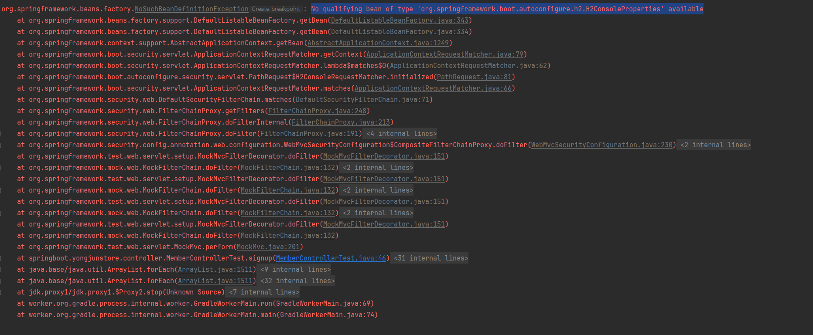
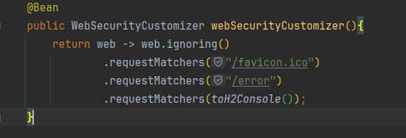

## 해당 문구의 에러
 
No qualifying bean of type 'org.springframework.boot.autoconfigure.h2.H2ConsoleProperties' available

  

  

controller 테스트 과정에서 발생했다.

  

securityConfig 안에

  

  

.requestMatchers(toH2Console() --> 해당 부분을 지워 주면 해결된다.
