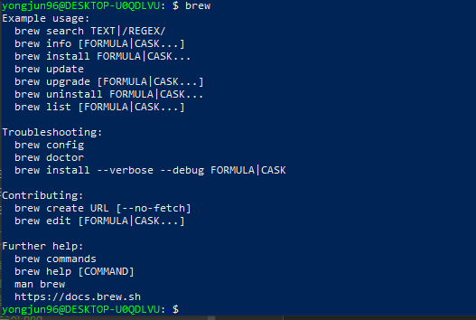
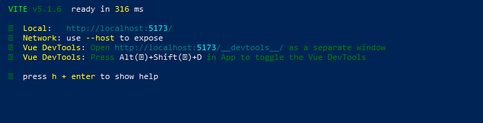
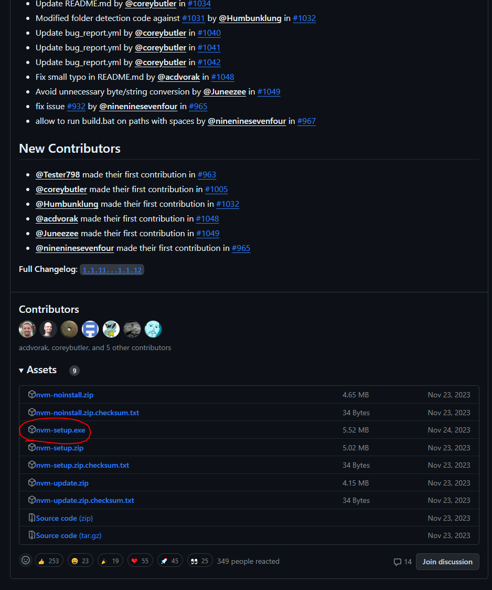
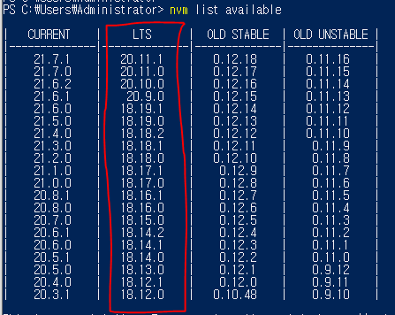
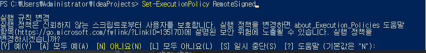

## vue.js는 웹프론트엔드 프레임워크

- 컴포넌트(Component)는 기반의 SPA(single Page Application)를 구축할 수 있게 해주는 프레임워크

<br>

### 컴포넌트 (Component)
 - 웹을 구성하는 로고, 메뉴바, 버튼, 모달창 등.. 페이지의 다양한 UI 요소
 - 재사용 가능하도록 구조화 한 것.

### SPA(single Page Application)
- 단일 페이지 어플리케이션
- 하나의 페이지에서 `필요한 영역만 부분 로딩`
- 빠른 페이지 변환 and 적은 트래픽 양

<br><br>

## 필요한 모듈 설치(Ubuntu 환경에서 진행)

<br>

- wsl 설치 (WSL을 실행하고 Linux의 Ubuntu 배포를 설치하는 데 필요한 기능을 사용하도록 설정)
```shell
wsl --install
```

<br>

- Homebrew 설치
```shell
/bin/bash -c "$(curl -fsSL https://raw.githubusercontent.com/Homebrew/install/HEAD/install.sh)"
```
- 환경변수 등록 (한 라인씩 등록)
```shell
test -d ~/.linuxbrew && eval $(~/.linuxbrew/bin/brew shellenv)
test -d /home/linuxbrew/.linuxbrew && eval $(/home/linuxbrew/.linuxbrew/bin/brew shellenv)
test -r ~/.bash_profile && echo "eval \$($(brew --prefix)/bin/brew shellenv)" >>~/.bash_profile
echo "eval \$($(brew --prefix)/bin/brew shellenv)" >>~/.profile
```

<br>

- 세팅확인
```shell
brew
```

<br>



<br><br>

- yongjun-store-vue 디렉토리 생성
```shell
mkdir yongjun-store-vue
```

<br>

- node 설치
```shell
sudo apt install nodejs
```

<br>

- nodeenv 설치 (node 버전16.20.0를 -> nodeenv-16 라는 이름으로 설치)
```shell
nodeenv --node=16.20.0 nodeenv-16
```

<br>

- nodeenv-16으로 activate (node 16버전으로 변환)
```shell
 . ./nodeenv-16/bin/activate
 또는 
 source nodeenv-16/bin/activate
```

<br>

- nodeenv-16으로 activate 빠져 나오기
```shell
deactivate_node
```

<br>

<br><br>


## vue 설치

<br>

- 사용하고 싶은 프로젝트명 입력 후 설치
```shell
npm init vue@latest
```

<br>

- npm 설치
- 사용하고 싶은 프로젝트로 이동 후 설치
```shell
npm install
```

<br>


<br><br>


- local 실행
```shell
npm run dev
```

<br>




해당 포트 : localhost:5173 접속!!

<br>


<br>

<span style="color:#819FF7;">**위와 같은 화면이 나온다면 접속 성공!!**</span>

<br><br>


---


<br>


## 필요한 모듈 설치(Windows 환경에서 진행)

- nvm (node version manager)
  - node.js는 버전이 빠르게 업데이트되기 때문에 동일한 서버 환경 내에서 버전을 전환하면서 사용해야 한다.
  - nvm(노드 버전 관리도구)은 여러 버전의 node.js를 설치 버전을 선택해서 사용 가능.
  - 우분투에서 사용했던 nodeenv와 같다.

<br>


관련 문서 : [https://github.com/coreybutler/nvm-windows#installation--upgrades](https://github.com/coreybutler/nvm-windows#installation--upgrades)
<br>
다운로드 : [https://github.com/coreybutler/nvm-windows/releases](https://github.com/coreybutler/nvm-windows/releases)

<br>



<br>

- 설치가 완료되면 powerShell에서 명령 실행 (설치가능한 버전 확인)
```shell
nvm list available
```
<br>




<span style="color:#819FF7;">**LTS버전이 검증된 버전이다.**</span>

<br><br>

- nvm 다운로드 (ex). nvm install 20.11.0 
```shell
nvm install <version>
```

- nvm 버전 전환
```shell
nvm use <version>
```

<br>

- 사용하고 싶은 프로젝트명 입력 후 옵션 선택
```shell
npm init vue@latest
```

<br>


<br>

- 프로젝트로 이동 후 설치
```shell
npm install
```

- 로컬실행
```shell
npm run dev
```


<br><br>


- <span style="color:#FA5858;">**이 부분은 리눅스가 아닌 Windows에서 발생할 수 있음.**</span>

<br>

Windows powerShell은 


위와 같은 실행정책 관련 에러가 발생한다.

<br><br>

#### powerShell의 정책

| excution policies |내용|
|-------------------|--|
| AllSigned         |모든 스크립트와 구성 파일에 신뢰할 수 있는 발행자의 서명이 존재할때 실행가능|
| Bypass            |어떤 것도 차단하지 않고, 경고나 안내 없이 실행가능|
| Default           |Windows 클라이언트는 Restricted를, Windows 서버는 RemoteSigned를 적용하여 실행|
| RemoteSigned      |인터넷에서 다운로드 되어지지 않고, 로컬 컴퓨터에서 작성된 스크립트를 디지털 서명 없이 실행가능|
| Restricted        |스크립트 허용하지 않음. 스크립트 파일[ex) .ps1xml, .psm1, .ps1]들의 실행을 막음|
| Undefined         |정의되지 않은 경우 Default 실행정책 따름.|
| Unrestricted      |서명되지 않은 스크립트 실행 가능하지만, 경고는 함.|

<br>

위 정책 중에서 RemoteSigned 정책으로 수정한다.


<br><br>

- 현재 정책을 확인

```shell
Get-ExecutionPolicy
```

<br>

현재 정책은 `Restricted`이므로 `RemoteSigned`로 수정

```shell
Set-ExecutionPolicy RemoteSigned
```

<br>




당연히 <span style="color:#819FF7;">**'Y'**</span> 입력


<br><br>

## vue 테스트

<br>


- 생성된 프로젝트로 이동
```shell
cd yongjun-store-vue
```

<br><br>

- 서버 실행
```shell
npm run dev
```


해당 포트 : localhost:5173 접속!!

<br>


<br>

<span style="color:#819FF7;">**위와 같은 화면이 나온다면 접속 성공!!**</span>

<br><br>

<br><br>


