## Oauth2.0 Google 로그인 구현

- OAuth는 사용자들이 비밀번호 없이 다른 웹의 자신의 정보를 통해 접근 권한을 부여 받을 수 있는 개방형 표준 방식이다.
- 즉, 개인정보 관리 책임을 위임하는 것.

 

 

### 진행 과정
1. 구글 계정으로 로그인
2. 로그인 성공되면 Google 승인 서버에서 Authorization Code를 발급
3. Authorization Code로 Access Token 발급
4. Access Token으로 Google 자원 서버의 유저정보 요청
5. 유저정보 반환

---

 

## Google Cloud 프로젝트 생성

 

해당 URL 접속 : [https://console.cloud.google.com](https://console.cloud.google.com/)

 

 

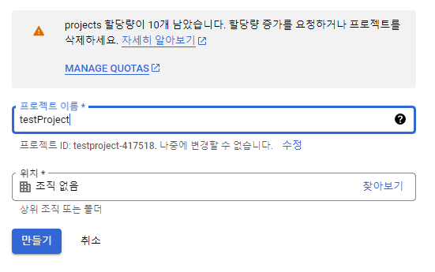

만들기 클릭

 

 

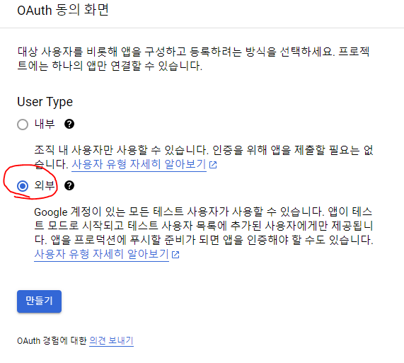

외부를 체크하고 만들기

 

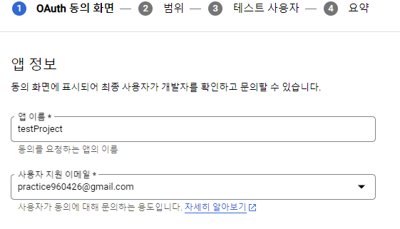

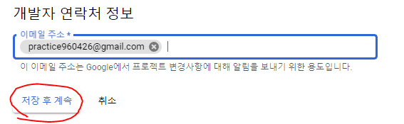

필수 입력값 : `앱이름`, `사용자 지원 이메일`, `개발자 연락처 정보` 만 입력하고 저장 후 계속 가능.

 

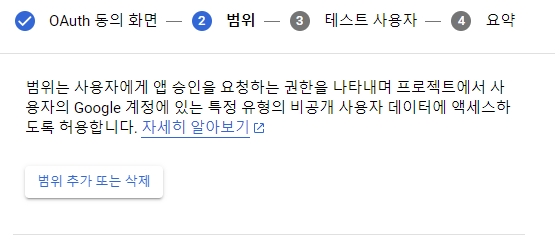

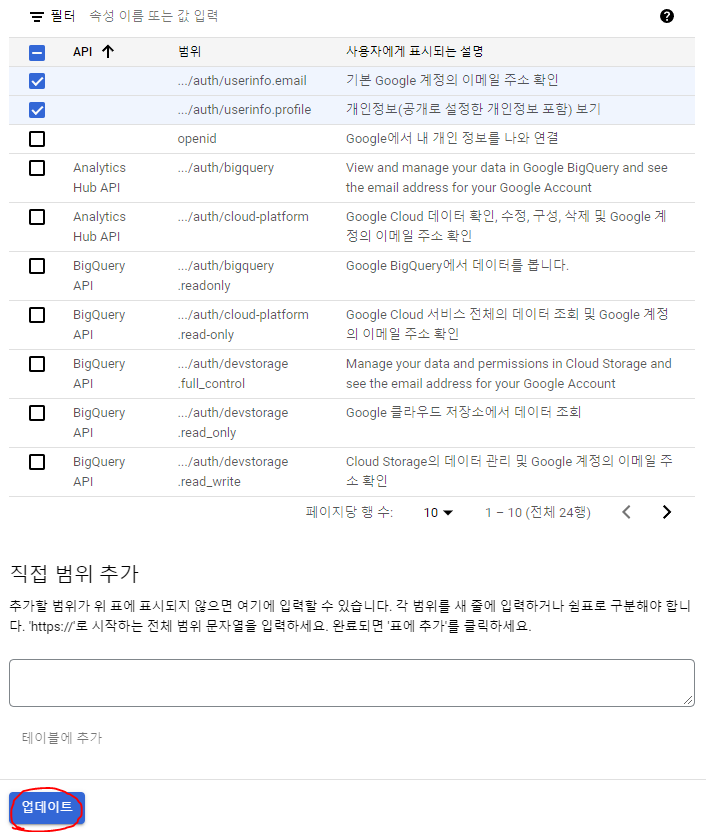

`이메일 주소`와 `개인정보`만 받을 것이기 때문에 2개 체크하고 업데이트

 

선택한 권한 확인. 저장 후 계속

 

테스트 사용자 추가 후 계속

 

정보 확인 후, 대시보드로 돌아가기

  

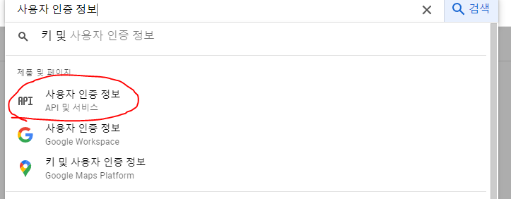

사용자 인증 정보 이동

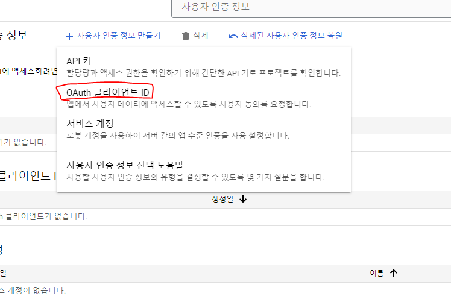

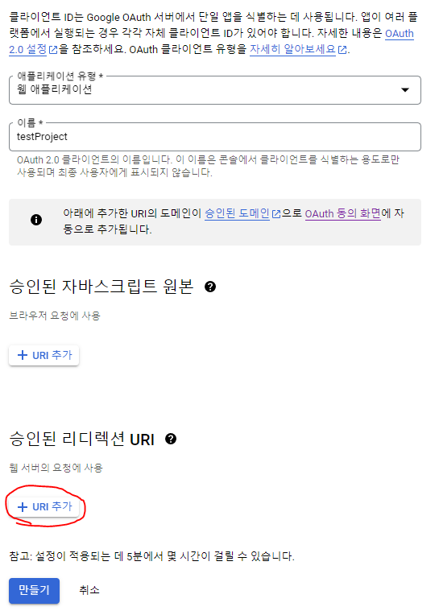

유형 : `웹 애플리케이션` 

이름 : `사용자 정의`

URI : `프로젝트의 Controller URI 입력`

 

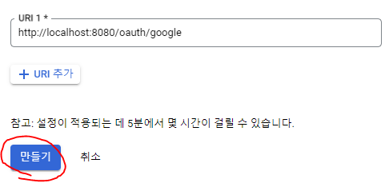

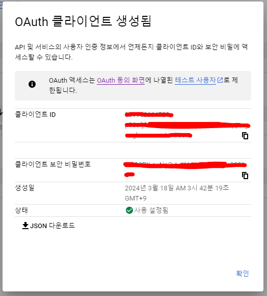

`클라이언트 ID`와 `비밀번호`를 발급 받으면 준비 완료.

