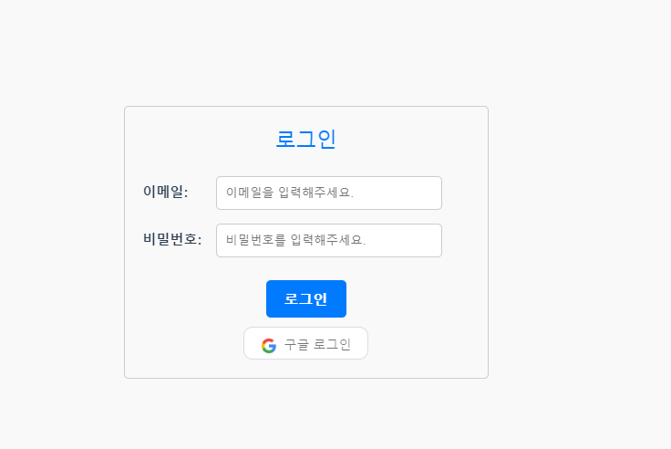
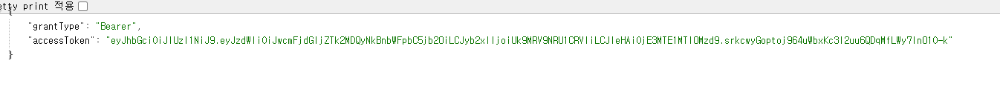
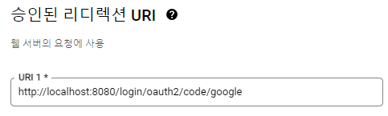
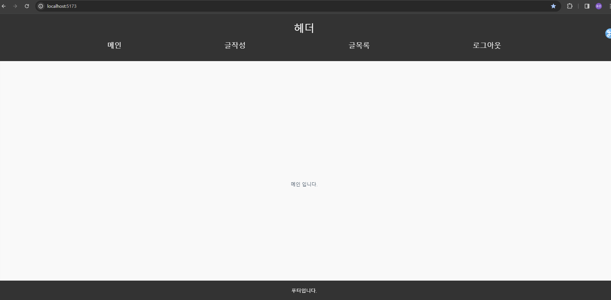

# 문제상황



<br>

vue로 화면을 구성하고 구글 로그인을 하던 중 문제 발생
<br>
구글 로그인을 하게 되면,

<br>


<br>

계정을 선택 후, 




결과가 <span style="color:#819FF7;">**잘 나오는 듯**</span> 하다.
<br>
그렇게 잘 되는 줄 알았으나.. 사용자는 토큰이 나오는 페이지를 확인할 필요가 없을 뿐더러 사용자 페이지가 아닌 [http://localhost:8080/login/oauth2/code/google](http://localhost:8080/login/oauth2/code/google)
엔드포인트로 이동되는 상황이 나오고 말았다.


<br>

---

## 해결 시도

<br>

처음에는 프론트에서 팝업을 이용해서 처리해보려고 했다.
<br><br>

이런 느낌.

```javascript
function openPopup() {
    
    // 새로운 팝업 창 열기
    const width = 600;
    const height = 400;
    const left = (window.innerWidth - width) / 2;
    const top = (window.innerHeight - height) / 2;
    const options = `width=${width},height=${height},left=${left},top=${top},resizable=yes,scrollbars=yes`;

    popupWindow = window.open("http://localhost:8080/oauth2/authorization/google", "_blank", options);

    // 팝업에서 로그인이 성공하고 토큰을 전달할 때 호출할 함수
    const sendTokenToParent = (token) => {
        // 부모 창으로 JSON 형식의 토큰 전송
        window.opener.postMessage(JSON.stringify(token), window.location.origin);
        // 팝업 닫기
        popupWindow.close();
    };

    // 팝업에서 로그인 성공 시 호출될 함수
    window.onLoginSuccess = (token) => {
        // 토큰을 JSON 형식으로 출력하고 부모 창으로 전달
        sendTokenToParent({
            grantType: 'Bearer',
            accessToken: token
        });
    };
}
```

<br>

히자만 팝업창을 컨트롤할 수가 없었다.
<br>



기본적으로 내가 사용하고 있던 URI는 google에서 지원해주는 엔드포인트였는데 당연하게도 내가 컨트롤할 수 없는 창으로 넘어가 버리기 때문에 팝업으로 해결하는 과정은 폐기했다.

<br>

그렇다면 결국 문제는 `불필요한 토큰을 보는 화면`이 호출되는 것 인데 URI를 프론트홈 URI로 바로 이동시켜 보기로 했다.

```java

package springboot.yongjunstore.config.handler;

import com.fasterxml.jackson.databind.ObjectMapper;
import jakarta.servlet.ServletException;
import jakarta.servlet.http.HttpServletRequest;
import jakarta.servlet.http.HttpServletResponse;
import lombok.RequiredArgsConstructor;
import lombok.extern.slf4j.Slf4j;
import org.springframework.http.HttpStatus;
import org.springframework.security.core.Authentication;
import org.springframework.security.oauth2.core.user.OAuth2User;
import org.springframework.security.web.authentication.SimpleUrlAuthenticationSuccessHandler;
import org.springframework.stereotype.Component;
import springboot.yongjunstore.config.jwt.JwtDto;
import springboot.yongjunstore.config.jwt.JwtProvider;
import springboot.yongjunstore.config.service.RefreshTokenService;
import springboot.yongjunstore.service.MemberService;

import java.io.IOException;

@Component
@Slf4j
@RequiredArgsConstructor
public class OAuthenticationSuccessHandler extends SimpleUrlAuthenticationSuccessHandler {

    private final JwtProvider jwtProvider;
    private final MemberService memberService;
    private final RefreshTokenService refreshTokenService;

    @Override
    public void onAuthenticationSuccess(HttpServletRequest request, HttpServletResponse response, Authentication authentication) throws IOException, ServletException {

        // OAuth2User로 캐스팅하여 인증된 사용자 정보를 가져온다.
        OAuth2User oAuth2User = (OAuth2User) authentication.getPrincipal();

        // 사용자 이메일을 가져온다.
        String email = oAuth2User.getAttribute("email");

        // CustomOAuth2UserService에서 로그인한 회원 존재 여부를 가져온다.
        boolean isExist = oAuth2User.getAttribute("exist");

        // OAuth2User로 부터 Role을 얻어온다.
        String role = oAuth2User.getAuthorities().stream().
                findFirst() // 첫번째 Role을 찾아온다.
                .orElseThrow(IllegalAccessError::new) // 존재하지 않을 시 예외를 던진다.
                .getAuthority(); // Role을 가져온다.


        // jwt token 발행을 시작한다.
        JwtDto token = jwtProvider.googleLoginGenerateToken(email, role);
        log.info("jwtToken = {}", token.getAccessToken());

        response.setContentType("application/json;charset=UTF-8");
        response.setStatus(HttpStatus.OK.value());
        //response.addHeader("grantType", token.getGrantType());
        //response.addHeader("accessToken", token.getAccessToken());

        //ObjectMapper objectMapper = new ObjectMapper();
        //objectMapper.writeValue(response.getWriter(), token);

        //회원이 존재하지 않을 경우 DB에 회원가입 시키고 토큰 발급
        if (!isExist) {
            memberService.googleSignup(oAuth2User);
        }

        // refreshToken 저장
        refreshTokenService.saveRefreshToken(token);

        // 클라이언트로 리디렉션하여 토큰 정보를 전달
        response.sendRedirect("http://localhost:5173?accessToken=" + token.getAccessToken());
    }

}


```

<br>

```java
response.addHeader("grantType", token.getGrantType());
response.addHeader("accessToken", token.getAccessToken());

ObjectMapper objectMapper = new ObjectMapper();
objectMapper.writeValue(response.getWriter(), token);
```

일단 여러가지 시도를 해보았는데 addHeader에 포함에서 넘기고 싶었으나.. sendRedirect를 사용하면 `클라이언트에게 새로운 URL로 이동하도록 요청` 하는 것이기 때문에 헤더 값을 직접 추가할 수가 없었다.

<br>

json 방식은 처음봤던 빈 창에 json만 덩그러니 출력하고 답이 없기 때문에 폐기했다. 

<br>

공식 문서 : [https://developers.google.com/identity/protocols/oauth2/javascript-implicit-flow?hl=ko](https://developers.google.com/identity/protocols/oauth2/javascript-implicit-flow?hl=ko)


<br>

공식 문서를 찾아 보니 정보를 URI에 같이 붙여 전송하는 모습을 볼 수 있었다!!
```java
// 클라이언트로 리디렉션하여 토큰 정보를 전달합니다.
response.sendRedirect("http://localhost:5173?accessToken=" + token.getAccessToken());
```

그래서 마찬가지로 내가 발급한 token을 URI에 붙여서 전송하기로 했다.


<br>

## 프론트 문제

<br>

하지만 여기서 또 문제가 발생했다..

```javascript
    googleLogin(){
  axios.get('http://localhost:8080/oauth2/authorization/google')
    .then(response => {
      console.log(response.data);
    })
    
    .catch(error => {
      console.error('에러 발생:', error);
    });
},
```

http://localhost:8080/oauth2/authorization/google 엔드포인트는 결국 구글에서 지원해주는 것이라, CORS 설정을 열어줄 방법이 없다.
즉, axios를 사용할 수 없다는 얘기

<br>

여기서 너무 답답하게 막혔다. 잘 모르는 것도 있고 어떻게 해야 할지 감이 잡히지 않았다.
<br>

## 해결

<br>


```javascript
<a id="google-signin-button" class="google-signin-button" href="http://localhost:8080/oauth2/authorization/google">
...
```
일단 a태그를 사용해서 이동시키기로 했다.


<br>

결과 적으로는 완성 했지만, 토큰이 노출되는 것이 신경쓰였다.
<br>
URI에서 토큰정보를 지우고 `localStorage` 토큰을 저장하고 메인으로 이동하게 끔 해보기로 했다.

```javascript

export default {
  mounted() {
    // 현재 URL에서 accessToken 파라미터 값
    const urlParams = new URLSearchParams(window.location.search);
    const accessToken = urlParams.get('accessToken');

    // accessToken이 존재할 경우 localStorage에 저장
    if (accessToken) {
      // localStorage에 accessToken을 저장
      localStorage.setItem('accessToken', accessToken);

      // URI에서 accessToken을 제거
      urlParams.delete('accessToken');

      // URL에서 '?'를 제거한 뒤에 다시 설정
      const newUrl = window.location.pathname + urlParams.toString();
      window.history.replaceState({}, document.title, newUrl);

      // 토큰을 저장한 후에는 필요에 따라 다른 작업을 수행
      console.log('토큰이 localStorage에 저장되었습니다.');
    }
  }
}

```

위와 같이 파라미터로 넘어온 값을 `accessToken`에 저장하고 존재하는 경우 `localStorage`에 저장
<br>
URI에서 `accessToken`과 `?` 부분도 지워준 후 새로고침 해주었다.

<br>




<br>

원하는 방식대로 로드된 모습.

<br>

사실 뭔가 굉장히 찝찝한 방법으로 해결이 된 느낌이 든다. 걸리는 부분도 많고 배워야 되는 부분도 더 많다는 걸 느꼈다.
<br>
특히, 프론트에 대해서 너무 모르다 보니 어떤 식으로 받아야 하고 어떤 식으로 주어야 하는지 조금 이나마 느껴 봤던 계기가 되었다.


