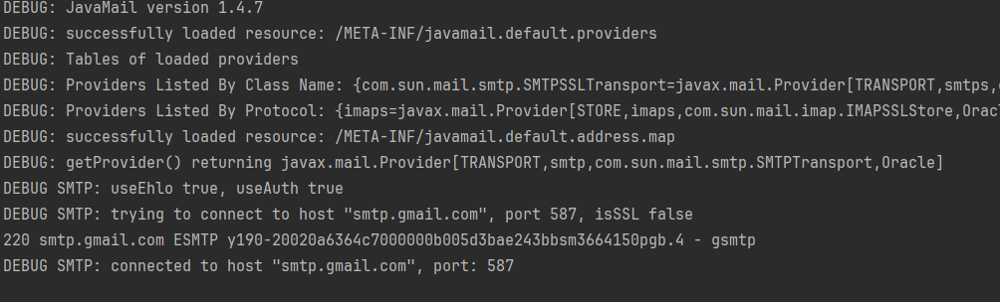
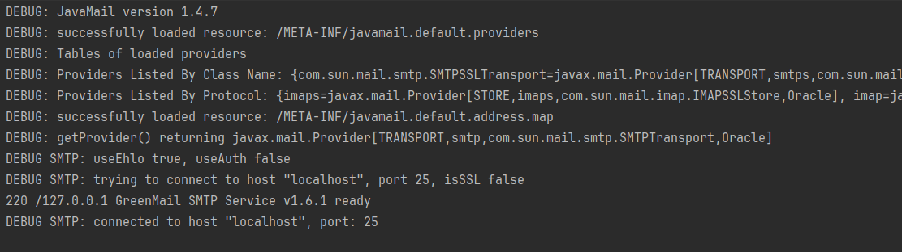

# GreenMail

- `GreenMail`은 Java용 오픈 소스 테스트 전용 이메일 테스트 서버이다.
- 실제 `SMTP` 및 `POP3/IMAP` 서버와 유사한 방식으로 `이메일을 수신하고 전송` 가능. **(실제 이메일 서버 없이 테스트 가능!!)**
- 테스트에 필요한 `여러 가지 이메일 계정을 생성`하여 사용 가능.
- 테스트 이메일을 수신하고 해당 `이메일의 내용을 확인` 가능.
- 특정 이메일이 정상적으로 `전송되었는지 확인` 가능.

<br>

### 용어 알아보기

<br>

SMTP란? (Simple Mail Transfer Protocol)
- 인터넷에서 이메일을 보내는 데 사용되는 표준 프로토콜
- TCP/IP 프로토콜 스택 위에서 작동하며, 전송하는 이메일 메시지의 형식과 라우팅 방법을 정의
- 일반적으로 SMTP는 포트 25번을 사용하여 이메일 서버와 통신

<br>

POP3란? (Post Office Protocol version 3)
- 이메일 클라이언트가 이메일 서버에서 이메일을 가져오는 데 사용
- 이메일을 서버에서 클라이언트로 다운로드하여 클라이언트의 로컬 컴퓨터에 저장
- 서버에서 이메일을 다운로드하고 서버에서 삭제하는 방식으로 동작
- 클라이언트에 저장된 이메일은 보통 서버에도 저장하지 않음

<br>

IMAP란? (Internet Message Access Protocol)
- 이메일 클라이언트가 이메일 서버에 저장된 이메일을 직접 관리할 수 있도록 하는 프로토콜
- 이메일 서버에 있는 이메일을 클라이언트로 전송하는 대신, IMAP는 서버에 있는 이메일을 클라이언트에서 직접 관리 및 상태 동기화
- 이메일은 서버에 그대로 남아 있고 여러 기기에서 동일한 이메일에 액세스 가능

<br>

일반적으로,   
`POP3는 이메일을 로컬 컴퓨터로 가져오고 서버에서 삭제`하는 방식  
`IMAP은 이메일을 서버에 남겨두고 클라이언트 간에 상태를 동기화`하는 방식

**IMAP**가 `여러 기기에서 이메일을 동기화`하는 데 효과적이며, `이메일에 접근할 때 용이`하다.


<br>

---

<br>

### test 코드에 적용

<br>

일단 해당 라이브러리를 사용하게 된 이유는 테스트 환경에서도 `실제 메일이 전송`되고 있었기 때문이다.  
테스트 시에는 실제 메일이 발송되지 않도록 하는게 이번 목표.

1. 의존성 추가

```java
    // Gradle 가짜 메일 인증 객체
    testImplementation 'com.icegreen:greenmail:1.6.1'
```

<br>

2. 테스트 코드에 작성

```java
class MailControllerTest {


    private GreenMail greenMail;
    @Autowired
    private MockMvc mockMvc;
    @Autowired
    private ObjectMapper objectMapper;
    @Autowired
    private MemberRepository memberRepository;
    @Autowired
    private RedisUtils redisUtils;

    @BeforeEach
    void setUp() {
        redisUtils.deleteAllKeys();
    }

    @Test
    @DisplayName("인증 메일 보내기 성공")
    void signupSuccess() throws Exception {

        greenMail = new GreenMail(ServerSetup.SMTP);
        greenMail.start();

        //given
        Member member = Member.builder()
                .name("김용준")
                .password("qwer!1234")
                .role(Role.ADMIN)
                .email("practice960426@gmail.com")
                .build();

        memberRepository.save(member);

        SendEmail sendEmail = new SendEmail();
        sendEmail.setEmail(member.getEmail());

        //expected
        mockMvc.perform(post("/mailSend")
                        .contentType(MediaType.APPLICATION_JSON)
                        .content(objectMapper.writeValueAsString(sendEmail))
                )
                .andExpect(status().isOk())
                .andDo(print());
        
        
        greenMail.stop();
    }
}
```

<br>

```java
// GreenMail을 사용할 수 있게 추가해 준 후
private GreenMail greenMail;

  ...
  
  // GreenMail을 시작
  greenMail = new GreenMail(ServerSetup.SMTP);
  greenMail.start();

  //메일 전송이 끝나면 종료
  greenMail.stop();
  
```

<br>

---

### 문제

<br>

간단하게 해결될 줄 알았는데 실행된 것을 보니



`host`와 `port`가 기존에 세팅했던 그대로 로그가 찍히더니.. 실제로 메일이 발송되었다..
<br>
그렇다면, 기존에 사용하고 있던 `EmailConfig`의 세팅한 빈이 시작된 다는 것인데 뭔가 이상했다.
<br>
해당 문서의 예제를 봤을 때도 뭐가 문제인지 감이 잘 오지 않았다.
<br>
[https://greenmail-mail-test.github.io/greenmail/#examples](https://greenmail-mail-test.github.io/greenmail/#examples)

<br>

여기서 알게 된 점은 위에 서술했던 보낸 메일의 메세지를 확인해 볼 수 있다는 것 정도였다.  

그렇게 계속 찾아 보다가 문득 "빈으로 올려둔 `JavaMailSender`을 바꿔 봐야 하는거 아닌가?" 라는 생각이 들었다.

<br>

하지만 테스트 환경에 맞춘다면 실제로 메일을 보낼 수가 없지 않나... 생각하다가 test용 `Bean`을 만들어서 사용할 수 있는 방법이 있을 것 같아 바로 찾아 보았다.

<br>

---

<br>

### 문제 해결해 보기

찾아보니 test환경에서 사용할 수 있는 `@Profile("test")`이란 친구가 있었다.  
내가 `@Configuration`으로 등록한 객체에 선언해주면 test 시에 사용할 수 있다..!!


```java
import org.springframework.context.annotation.Bean;
import org.springframework.context.annotation.Configuration;
import org.springframework.context.annotation.Primary;
import org.springframework.context.annotation.Profile;
import org.springframework.mail.javamail.JavaMailSender;
import org.springframework.mail.javamail.JavaMailSenderImpl;

import java.util.Properties;

@Configuration
@Profile("test")
public class TestEmailConfig {

    @Bean
    public JavaMailSender greenMail() {
        JavaMailSenderImpl mailSender = new JavaMailSenderImpl();
        mailSender.setHost("localhost");
        mailSender.setPort(25);

        Properties props = mailSender.getJavaMailProperties();
        props.put("mail.transport.protocol", "smtp");
        props.put("mail.smtp.auth", "false");
        props.put("mail.smtp.starttls.enable", "false");
        props.put("mail.debug", "true");

        return mailSender;
    }
}
```

<br>

위 처럼 간단하게 test를 위한 `TestEmailConfig`를 작성했다.  


<br>

```java
@AutoConfigureMockMvc
@SpringBootTest
@ActiveProfiles("test")
class MailControllerTest {
  ...
}
```

그 후에 test코드에 `@ActiveProfiles("test")`를 사용해서 실행하라는 뜻으로 어노테이션을 달아 주었다.

<br>

잘 되려나 싶었지만, 또 에러가 발생했다.

```text
Caused by: org.springframework.beans.factory.UnsatisfiedDependencyException: Error creating bean with name 'mailController' 
defined in file [C:\Users\Administrator\IdeaProjects\yongjun-store\build\classes\java\main\springboot\yongjunstore\controller\MailController.class]: 
Unsatisfied dependency expressed through constructor parameter 0: Error creating bean with name 'mailService' defined in file [C:\Users\Administrator\IdeaProjects\yongjun-store\build\classes\java\main\springboot\yongjunstore\service\MailService.class]: 
Unsatisfied dependency expressed through constructor parameter 0: No qualifying bean of type 'org.springframework.mail.javamail.JavaMailSender' available: expected single matching bean but found 2: mailSender,greenMail
```
<br>

---

### 또 다른 문제

<br>

여러 에러 중에서 `expected single matching bean but found 2: mailSender,greenMail` 
해당 구문이 보였는데 `mailSender`와 `greenMail`라는 빈이 두개 등록되어 있어 뭘로 사용해야 할지 모른다는 말..

<br>

`@Profile("test")`를 달아 준다고 해서 test 코드를 실행할 때 **기존에 사용 중인 빈을 덮는게 아니라**  
그냥  `mailSender`와 `greenMail`가 같이 등록되는 것이 었다.

<br>

기존 : `mailSender`  
테스트 : `greenMail`

<br>

여기서 엄청 시간을 많이 쏟은 것 같다.. 에러도 너무 길고 문제 파악을 하는데 까지 오래 걸렸다.

<br>

---

<br>

### 해결

<br>

찾아 보던 중. `@Primary`라는 어노테이션을 발견했다!!!  
어떤 기능을 하는 녀석인가 보니  
`Spring 애플리케이션에서 동일한 타입의 여러 빈이 존재할 때, Spring은 이를 해결하기 위해 자동 와이어링(autowiring) 시에 해당 타입의 빈 중 하나를 선택한다.`  
`이러한 선택 기준에 따라 원하는 빈이 선택되지 않을 수 있다. 이런 경우 @Primary 어노테이션을 사용하여 우선순위를 지정 가능하다.`
<br>

내가 처한 상황에 딱 걸맞는 어노테이션이었다.  
매우 간단하게 적용할 수 있었다.

```java
import org.springframework.context.annotation.Bean;
import org.springframework.context.annotation.Configuration;
import org.springframework.context.annotation.Primary;
import org.springframework.context.annotation.Profile;
import org.springframework.mail.javamail.JavaMailSender;
import org.springframework.mail.javamail.JavaMailSenderImpl;

import java.util.Properties;

@Configuration
@Profile("test")
public class TestEmailConfig {

    @Bean
    @Primary // 붙여주면 해결
    public JavaMailSender greenMail() {
        JavaMailSenderImpl mailSender = new JavaMailSenderImpl();
        mailSender.setHost("localhost");
        mailSender.setPort(25);

        Properties props = mailSender.getJavaMailProperties();
        props.put("mail.transport.protocol", "smtp");
        props.put("mail.smtp.auth", "false");
        props.put("mail.smtp.starttls.enable", "false");
        props.put("mail.debug", "true");

        return mailSender;
    }
}
```

<br>

```java
import com.fasterxml.jackson.databind.ObjectMapper;
import com.icegreen.greenmail.util.GreenMail;
import com.icegreen.greenmail.util.ServerSetup;
import org.assertj.core.api.Assertions;
import org.junit.jupiter.api.BeforeEach;
import org.junit.jupiter.api.DisplayName;
import org.junit.jupiter.api.Test;
import org.junit.jupiter.api.extension.ExtendWith;
import org.springframework.beans.factory.annotation.Autowired;
import org.springframework.boot.test.autoconfigure.web.servlet.AutoConfigureMockMvc;
import org.springframework.boot.test.context.SpringBootTest;
import org.springframework.http.MediaType;
import org.springframework.test.context.ActiveProfiles;
import org.springframework.test.context.junit.jupiter.SpringExtension;
import org.springframework.test.web.servlet.MockMvc;
import springboot.yongjunstore.config.RedisUtils;
import springboot.yongjunstore.domain.Member;
import springboot.yongjunstore.domain.Role;
import springboot.yongjunstore.repository.MemberRepository;
import springboot.yongjunstore.request.AuthCheckRequest;
import springboot.yongjunstore.request.SendEmail;

import javax.mail.internet.MimeMessage;

import static org.springframework.test.web.servlet.request.MockMvcRequestBuilders.post;
import static org.springframework.test.web.servlet.result.MockMvcResultHandlers.print;
import static org.springframework.test.web.servlet.result.MockMvcResultMatchers.status;

@ExtendWith(SpringExtension.class)
@AutoConfigureMockMvc
@SpringBootTest
@ActiveProfiles("test")
class MailControllerTest {


    private GreenMail greenMail;
    @Autowired private MockMvc mockMvc;
    @Autowired private ObjectMapper objectMapper;
    @Autowired private MemberRepository memberRepository;
    @Autowired private RedisUtils redisUtils;

    @BeforeEach
    void setUp() {
        redisUtils.deleteAllKeys();
    }

    @Test
    @DisplayName("인증 메일 보내기 성공")
    void signupSuccess() throws Exception {

        greenMail = new GreenMail(ServerSetup.SMTP);
        greenMail.start();

        //given
        Member member = Member.builder()
                .name("김용준")
                .password("qwer!1234")
                .role(Role.ADMIN)
                .email("practice960426@gmail.com")
                .build();

        memberRepository.save(member);

        SendEmail sendEmail = new SendEmail();
        sendEmail.setEmail(member.getEmail());

        //expected
        mockMvc.perform(post("/mailSend")
                        .contentType(MediaType.APPLICATION_JSON)
                        .content(objectMapper.writeValueAsString(sendEmail))
                )
                .andExpect(status().isOk())
                .andDo(print());

        // 전송된 메일 확인
        MimeMessage[] receivedMessages = greenMail.getReceivedMessages();
        Assertions.assertThat(receivedMessages.length).isEqualTo(1);
        Assertions.assertThat(receivedMessages[0].getSubject()).isEqualTo("비밀번호 변경 인증 메일입니다.");

        greenMail.stop();
    }
}
```

<br>


```java
// 전송된 메일 확인
MimeMessage[] receivedMessages = greenMail.getReceivedMessages();
Assertions.assertThat(receivedMessages.length).isEqualTo(1);
Assertions.assertThat(receivedMessages[0].getSubject()).isEqualTo("비밀번호 변경 인증 메일입니다.");
```

최종적으로 테스트를 작성했고 전송이 제대로 되었는지 확인까지 했다.

<br>




<br>

테스트를 위해 작성한 `greenMail`의 세팅이 정상적으로 적용된 모습.

<br>


---

<br>

### 마치며...

<br>

이번에 테스트를 작성하면서 몰랐던 부분들을 많이 알게 되었고 테스트를 작성하면서 기능을 테스트하는 것 뿐만이 아닌 작성한 코드의 동작이나 예외처리를 어떻게 했는지 다시한번 돌아보는 시간이 되었다..
  
생각보다 코드를 작성하면서 그냥 넘겼던, 또는 생각하지 못했던 부분들이 테스트를 작성하면서 많이 보였고  
왜 테스트를 해야 하는지 다른 의미로 많이 느꼈던 것 같다.  
<br>

