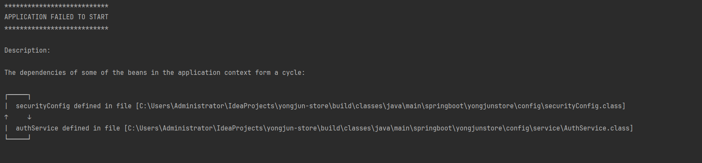
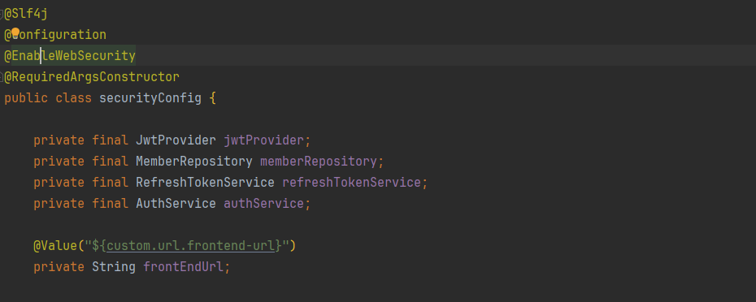
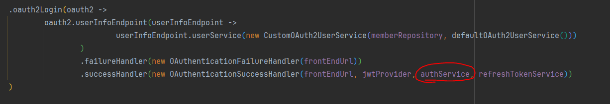
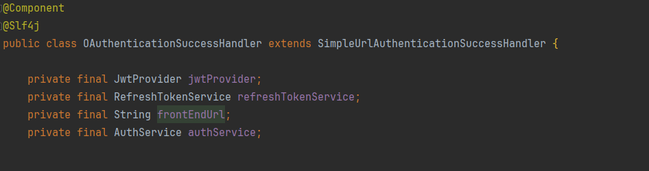

# 순환 참조 문제 발생



<br>

`RestDocs + Swagger` 문서를 작성하고 있는 도중에 `MemberService`에 `googleSignup`메서드를 `AuthService`로 이동 시키면서 발생했다.

<br>

### 순환 참조란?

- 서로 다른 `빈(Bean)`들이 서로를 참조하는 상태에서 주입되면 발생하는 문제이다.
- 즉, 스프링에서 어떤 `빈(Bean)`을 먼저 만들어야 할 지 <span style="color: #FF4500;">결정할 수 없게되는 상황</span>이라 할 수 있다.

<br>


```text
securityConfig -> authService -> securityConfig  
```

securityConfig는 authService를 필요로 하는데 authService는 securityConfig가 필요한 상황이다...

<br>





<br>

`SecurityFilterChain (Bean)`에 작성된 `OAuthenticationSuccessHandler (Component)`에서 authService를 필요로 하기 때문이다.

<br>



<br>

---

### 임시방편 @Lazy

- 찾아본 자료중에 `@Lazy`를 사용하여 지연 초기화를 해주어 애플리케이션이 실행되는 시점이 아닌, `Bean이 필요한 시점에 초기화`를 해준다고 한다.

<br>

하지만 이 방법은 <span style="color: #FF4500;">매우 위험하고 권장되지 않는 방법</span>이라고 한다.

<br>

이유는 크게 2가지
1. 지연 초기화로 인해 잘 못된 애플리케이션의 설계 문제를 발견 하는게 늦어 질 수 있다.
2. 지연 초기화되는 시점에 메모리가 부족하게 되면 빈을 저장할 수 없게 되어 큰 장애로 이어 질 수 있다.

<br>

**쓰지 말라는 이야기다..!!**

---

### 해결 방안

- 그렇다면 어떻게 해결해야 하나?
- **결국 직관적이고 가장 확실한 방법은 순환 참조를 끊어 내는 것이다.**

<br>

```java

    @Override
    public void onAuthenticationSuccess(HttpServletRequest request, HttpServletResponse response, Authentication authentication) throws IOException, ServletException {

        // OAuth2User로 캐스팅하여 인증된 사용자 정보를 가져온다.
        OAuth2User oAuth2User = (OAuth2User) authentication.getPrincipal();

        // 사용자 이메일을 가져온다.
        String email = oAuth2User.getAttribute("email");

        // CustomOAuth2UserService에서 로그인한 회원 존재 여부를 가져온다.
        boolean isExist = oAuth2User.getAttribute("exist");

        // OAuth2User로 부터 Role을 얻어온다.
        String role = oAuth2User.getAuthorities().stream().
                findFirst() // 첫번째 Role을 찾아온다.
                .orElseThrow(IllegalAccessError::new) // 존재하지 않을 시 예외를 던진다.
                .getAuthority(); // Role을 가져온다.


        // jwt token 발행을 시작한다.
        JwtDto token = jwtProvider.googleLoginGenerateToken(email, role);
        log.info("jwtToken = {}", token.getAccessToken());

        response.setContentType("application/json;charset=UTF-8");
        response.setStatus(HttpStatus.OK.value());

        //회원이 존재하지 않을 경우 DB에 회원가입 시키고 토큰 발급
        if (!isExist) {

            authService.googleSignup(oAuth2User);
        }

        // refreshToken 저장
        refreshTokenService.saveRefreshToken(token);

        // 클라이언트로 리디렉션하여 토큰 정보를 전달
        response.sendRedirect(frontEndUrl+"?accessToken=" + token.getAccessToken());
    }
```

<br>

코드를 확인해 보면 `authService`를 사용하는 이유는 `authService.googleSignup(oAuth2User);`으로 `googleSignup`메서드를 사용하기 위해서 이다.

<br>

구글 회원을 가입시키는 메서드로 `authService`가 적합하다고 생각되어 옮겼는데 순환 참조 문제를 해결하기 위해서는 `authService`의 참조를 끊어 내야 하므로


<br>

```java
package springboot.yongjunstore.config.handler;

import jakarta.servlet.ServletException;
import jakarta.servlet.http.HttpServletRequest;
import jakarta.servlet.http.HttpServletResponse;
import lombok.extern.slf4j.Slf4j;
import org.springframework.beans.factory.annotation.Value;
import org.springframework.http.HttpStatus;
import org.springframework.security.core.Authentication;
import org.springframework.security.oauth2.core.user.OAuth2User;
import org.springframework.security.web.authentication.SimpleUrlAuthenticationSuccessHandler;
import org.springframework.stereotype.Component;
import org.springframework.transaction.annotation.Transactional;
import springboot.yongjunstore.common.exception.GlobalException;
import springboot.yongjunstore.common.exceptioncode.ErrorCode;
import springboot.yongjunstore.config.jwt.JwtDto;
import springboot.yongjunstore.config.jwt.JwtProvider;
import springboot.yongjunstore.config.service.RefreshTokenService;
import springboot.yongjunstore.domain.Member;
import springboot.yongjunstore.domain.Role;
import springboot.yongjunstore.repository.MemberRepository;

import java.io.IOException;
import java.util.Optional;

@Component
@Slf4j
public class OAuthenticationSuccessHandler extends SimpleUrlAuthenticationSuccessHandler {

    private final JwtProvider jwtProvider;
    private final RefreshTokenService refreshTokenService;
    private final String frontEndUrl;
    private final MemberRepository memberRepository;


    public OAuthenticationSuccessHandler(@Value("${custom.url.frontend-url}") String frontEndUrl,
                                         JwtProvider jwtProvider,
                                         MemberRepository memberRepository,
                                         RefreshTokenService refreshTokenService) {

        this.memberRepository = memberRepository;
        this.frontEndUrl = frontEndUrl;
        this.jwtProvider = jwtProvider;
        this.refreshTokenService = refreshTokenService;
    }


    @Override
    public void onAuthenticationSuccess(HttpServletRequest request, HttpServletResponse response, Authentication authentication) throws IOException, ServletException {

        // OAuth2User로 캐스팅하여 인증된 사용자 정보를 가져온다.
        OAuth2User oAuth2User = (OAuth2User) authentication.getPrincipal();

        // 사용자 이메일을 가져온다.
        String email = oAuth2User.getAttribute("email");

        // CustomOAuth2UserService에서 로그인한 회원 존재 여부를 가져온다.
        boolean isExist = oAuth2User.getAttribute("exist");

        // OAuth2User로 부터 Role을 얻어온다.
        String role = oAuth2User.getAuthorities().stream().
                findFirst() // 첫번째 Role을 찾아온다.
                .orElseThrow(IllegalAccessError::new) // 존재하지 않을 시 예외를 던진다.
                .getAuthority(); // Role을 가져온다.


        // jwt token 발행을 시작한다.
        JwtDto token = jwtProvider.googleLoginGenerateToken(email, role);
        log.info("jwtToken = {}", token.getAccessToken());

        response.setContentType("application/json;charset=UTF-8");
        response.setStatus(HttpStatus.OK.value());

        //회원이 존재하지 않을 경우 DB에 회원가입 시키고 토큰 발급
        if (!isExist) {

            googleSignup(oAuth2User);
        }

        // refreshToken 저장
        refreshTokenService.saveRefreshToken(token);

        // 클라이언트로 리디렉션하여 토큰 정보를 전달
        response.sendRedirect(frontEndUrl+"?accessToken=" + token.getAccessToken());
    }


    @Transactional
    public void googleSignup(OAuth2User oAuth2User) {

        // ex). MEMBER
        String role = oAuth2User.getAuthorities().stream().
                findFirst() // 첫번째 Role을 찾아온다.
                .orElseThrow(IllegalAccessError::new) // 존재하지 않을 시 예외를 던진다.
                .toString().substring(5).trim(); // ROLE_ 부분 자르고 가져온다.


        Optional<Member> optionalUser = memberRepository.findByEmail(oAuth2User.getAttribute("email"));

        if(optionalUser.isPresent()){
            throw new GlobalException(ErrorCode.MEMBER_EMAIL_EXISTS);
        }

        Member member = Member.builder()
                .name(oAuth2User.getAttribute("name"))
                .email(oAuth2User.getAttribute("email"))
                .provider(oAuth2User.getAttribute("provider")) // ex). google
                .providerId(oAuth2User.getAttribute("sub"))
                .role(Role.valueOf(role))
                .build();

        memberRepository.save(member);
    }

}
```

다른 곳에서 주입받아 사용하는 것이 아닌, `OAuthenticationSuccessHandler`에서 직접 사용하는 방식으로 수정했다.

<br>

---

<br>

### 해결 이후

사실 `OAuthenticationSuccessHandler`에 직접 `googleSignup`메서드를 넣어서 해결 하는게 확실하지만 정말 옳은 방법인 지는 모르겠다..  
설계 단계에서 고민을 더 해보고 작성 했어야 했는데 그러지 못한 것 같아서 많이 아쉬운 마음이 있다.  
하지만 이번 계기로 순환 참조가 얼마나 위험한지 알게 되었고, 초기 설계 단계에서 미리 고려해야 한다는 사실을 알게 되었다.
<br>

앞으로도 계속 리펙토링을 하면서 개발을 진행할 예정 이지만, 초기에 한번 더 생각해보고 작성하는 습관을 기르면 좋을 것 같다.


