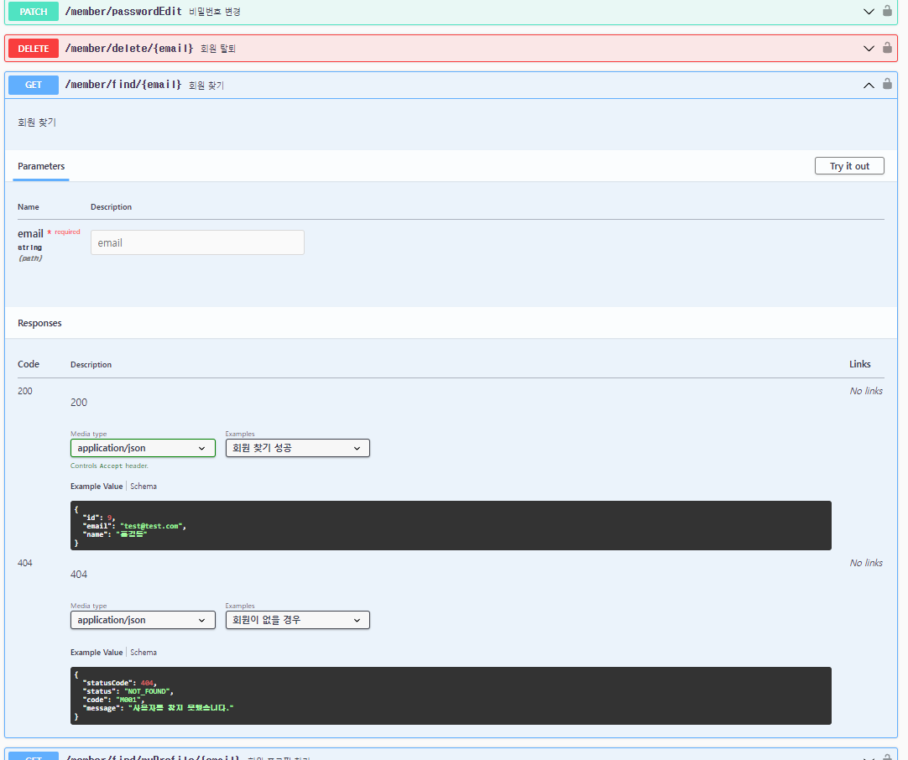

# RestDocs + Swagger란?
- `RestDocs`와 같이 `테스트 코드`를 이용하여 `API문서`를 작성할 수 있다.
- `RestDocs`의 단점인 시각적으로 불편하고 직접 API를 문서에서 테스트할 수 없는 점을 `SwaggerUi를 사용해서 개선`할 수 있다.


<br>

### epages. OpenAPI Specification(OAS)
- restful API 문서의 표준 규약
- SwaggerUi는 OAS를 API 스펙으로 시각화 해준다.


<br>

### RestDocs-api-spec
- RestDocs Wrapper Class를 이용해 테스트 코드를 작성하면 OAS를 만들어 준다.

<br>

즉, RestDocs Wrapper Class를 이용해서 OAS를 만들고 SwaggerUi를 이용해서 `API문서를 시각화` 해준다.

<br>

---

<br>

### 문제점

<br>

사용하면서 테스트를 반자동화하여 문서를 작성할 수 있다는게 편하면서도 재미있다고 느꼈다.  
하지만 사용하면서 한계를 느끼고 폐기하기로 했다... 작성해 놓은 것들이 아깝지만 어쩔 수 없는 선택이라고 생각한다.  
대충 작성법을 보자면 아래와 같다.

<br>

```java
    @Test
    @DisplayName("email로 회원 찾기 성공")
    void findMember() throws Exception {

        // given
        Member member = createMember(email, role);

        JwtDto jwt = jwtDto();


        // expected
        mockMvc.perform(RestDocumentationRequestBuilders.get("/member/find/{email}", member.getEmail())
                        .contentType(MediaType.APPLICATION_JSON)
                        .header(HttpHeaders.AUTHORIZATION, jwtDto().getGrantType()+" "+jwt.getAccessToken()))
                .andExpect(status().isOk())
                .andDo(print())
                .andDo(MockMvcRestDocumentationWrapper.document("회원 찾기 성공",
                                resourceDetails().description("회원 찾기"),
                                preprocessRequest(prettyPrint()),
                                preprocessResponse(prettyPrint()),
                                requestHeaders(headerWithName(HttpHeaders.AUTHORIZATION).description("Bearer 토큰").getAttributes()),
                                responseFields(
                                        fieldWithPath("id").type(JsonFieldType.NUMBER).description("ID"),
                                        fieldWithPath("email").type(JsonFieldType.STRING).description("이메일"),
                                        fieldWithPath("name").type(JsonFieldType.STRING).description("이름")
                                )
                        )

                );

    }
```

<br>

해당 테스트 코드로 작성된 Swagger문서.

<br>



여러가지 세팅법이 있고 사전에 준비해야 하는 것들이 많이 있지만,  
<span style="color: #FF4500;">**사용하지 않을 것이기 때문에 본문에서는 다루지 않는다.**</span>

<br>

##### @RequestPart, @ModelAttribute 문제

<br>

roomPost의 글을 작성할 때 `MultipartFile`를 사용하여 이미지를 업로드 한다.  
이미지 뿐만이 아니라 글작성에 필요한 request도 `@ModelAttribute`를 통해서 받는다.

<br>

```java
    @PostMapping(value = "/create")
    public ResponseEntity roomPostCreate(@Valid @ModelAttribute RoomPostRequest roomPostRequest,
                                            @RequestPart(value = "uploadImages") List<MultipartFile> uploadImages){

        roomPostService.createRoom(roomPostRequest, uploadImages);

        return ResponseEntity.status(HttpStatus.OK).build();
    }
```

<br>

문제의 원인이 된 Controller.
<br>
`@ModelAttribute`와 `@RequestParts`를 문서에 작성하기 위해서 아무리 찾아 보고 시도해봐도 답이 나오지 않았다.  

<br>

Spring Rest Docs 문서  
[https://docs.spring.io/spring-restdocs/docs/current/reference/htmlsingle/#documenting-your-api-request-parts-payloads-fields](https://docs.spring.io/spring-restdocs/docs/current/reference/htmlsingle/#documenting-your-api-request-parts-payloads-fields)


<br>

해당 문서를 보면 

```java
MockMultipartFile image = new MockMultipartFile("image", "image.png", "image/png", "<<png data>>".getBytes());
MockMultipartFile metadata = new MockMultipartFile("metadata", "", "application/json",
		"{ \"version\": \"1.0\"}".getBytes());

this.mockMvc.perform(multipart("/images").file(image).file(metadata).accept(MediaType.APPLICATION_JSON))
	.andExpect(status().isOk())
	.andDo(document("image-upload", requestPartFields("metadata", 
			fieldWithPath("version").description("The version of the image")))); 
```

<br>

requestPartFields를 사용하여 MockMultipartFile을 문서화 할 수 있다고 나와 있지만, RestDosc만 가능하고 실제로 SwaggerUi를 이용해서 문서를 작성하려고 하면  
테스트를 통과 하더라도 

<br>


<br>

위와 같이 필드를 만들 수가 없다...

```java
requestParameters( 
        parameterWithName("title").description("제목"),
        parameterWithName("name").description("이름")
),
```

<br>

`requestParameters`를 사용해서 param으로 받아온 값들을 문서에 만들 수 있다고 하는데 이것 또한 `MockMvcRestDocumentationWrapper`를 사용하여 만든다면 컴파일 조차 불가능하다...

<br>

더군다나 공식문서가 존재하지도 않으며, [https://github.com/ePages-de/restdocs-api-spec](https://github.com/ePages-de/restdocs-api-spec) 해당 repository의 README의 정보도 세팅과 간단한 시연정도 뿐이었다.

<br>

그렇게 계속 많은 시도를 해보고 찾아보아도 확실한 해결법이 나오지 않아서 지금 사용하기는 부적합하다고 판단했다.
<br>
OpenAPI의 버전을 2로 낮추면 위에서 언급했던 `requestParameters`를 사용할 수 있지만, 역시 `requestParts`는 문서에 적용이 되지 않는다.

<br>

---

<br>

# 해결

<br>

결국 Swagger를 사용하기로 하고 controller의 테스트는 그대로 꼼곰히 작성하며 Swagger 어노테이션을 항상 검수하기로 했다..
<br>

RestDocs는 문서로써 너무 보기에 불편하고 테스트를 직접 해볼 수 없기때문에 적합하지 않다고 생각했다.

<br>

해결이라고 보기는 애매하지만 이번에 어떤 점이 불편하고 어떤 점이 힘든지 확실히 알게 되었다.  
그렇다고 `RestDocs + Swagger`방식을 아예 포기할 생각은 아니다.  
시간이 있다면 더 알아 보고 해결방법이 있다며 다시 갈아 타고 싶다.  
<br>

그 만큼 매리트가 있다고 생각했다.  
하지만 지금은 사용하기 많이 애매하고 힘들다고 생각한다.


