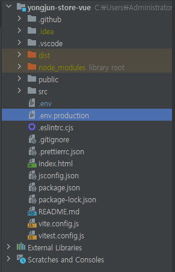
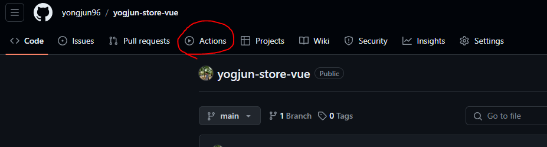
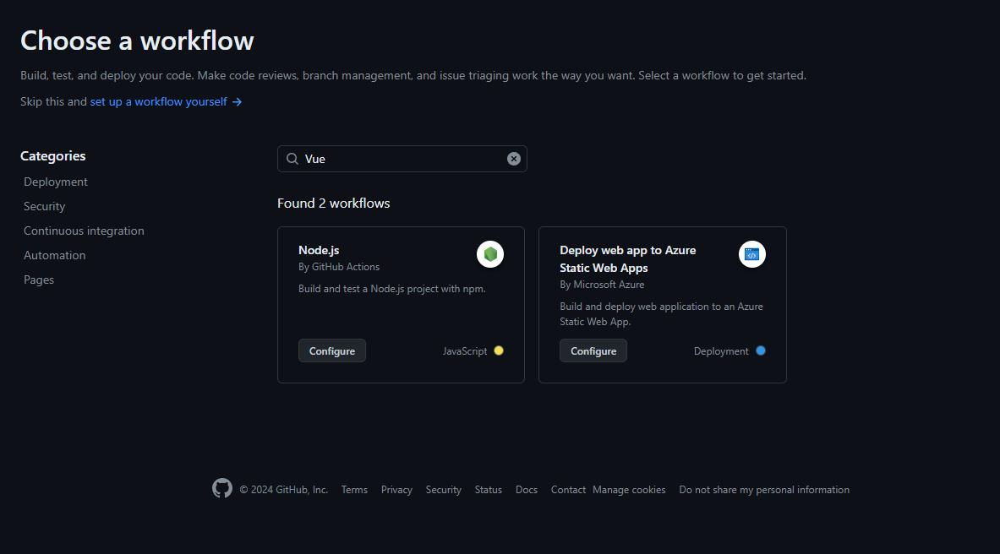
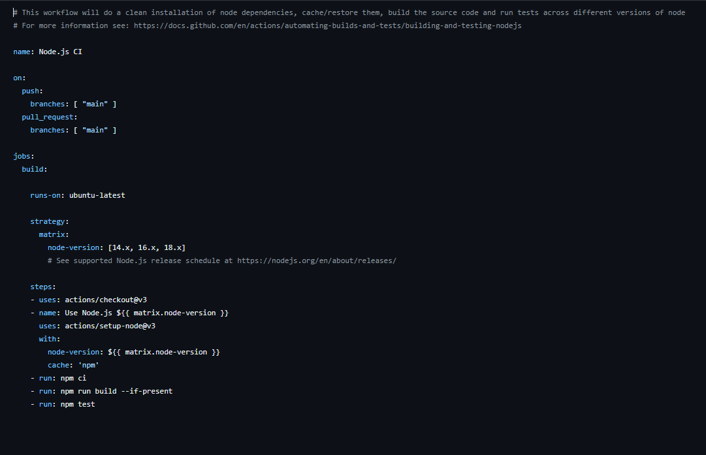
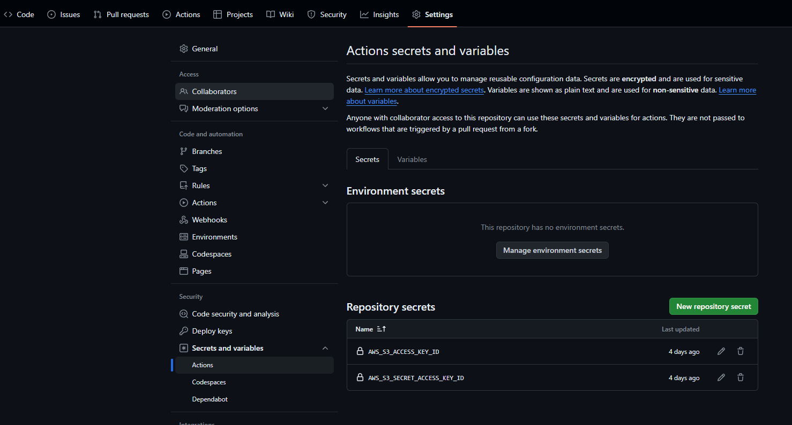
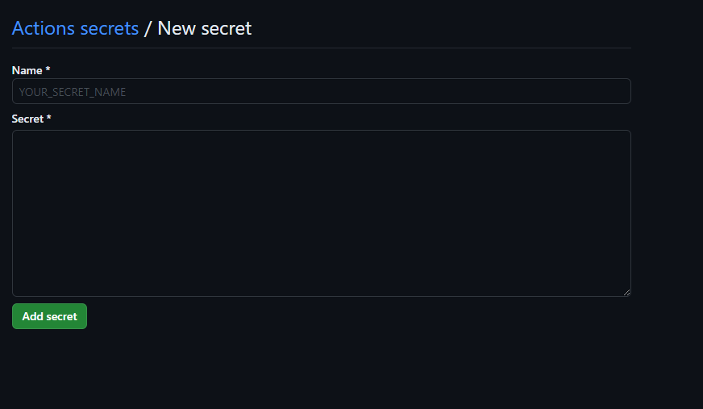
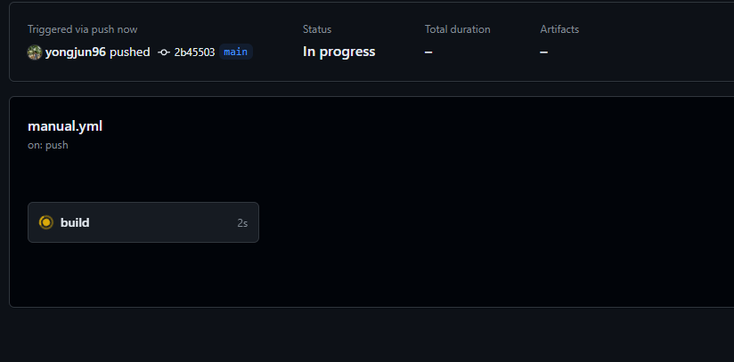
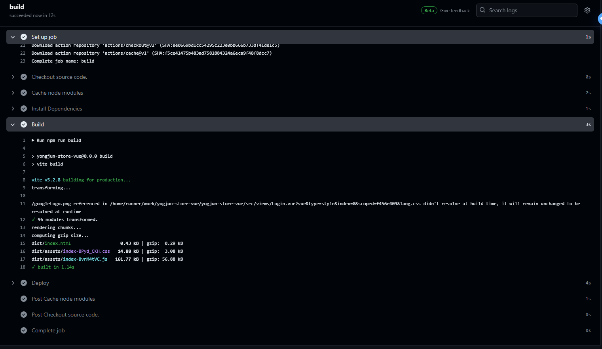

# Github 와 Github Actions을 이용한 CI/CD 구축

- `CI`란?
  - `Continuous Integration` **지속적인 통합을 의미**
  - 코드 등의 변경 사항이 정기적으로 빌드 및 테스트되어 통합 관리 하는 것을 뜻 한다.
  - `CI`로는 `Git`과 `Github`를 사용할 예정


  <br>

- `CD`란?
  - `Continuous Delivery` 와 `Continuous Depolyment` **지속적 서비스 / 지속적 배포를 의미**
  - 개발자의 변경 사항이 고객의 `Production`환경 까지 지속적으로 배포 / 서비스 되는 것을 뜻 한다.

<br>

- `Github Actions`란?
  - 코드 저장소인 `Github`의 이벤트가 발생하면 특정 작업을 정의해 수행시킬 수 있는 서비스이다.
  - 여기서는 `CD`를 수행 하기 위해 작업을 진행 했고, 배포 이외에도 여러 작업을 수행할 수 있다.
   
<br>

- `CI/CD`는 `프론트`와 `API서버`를 나누어 진행하였다.  
- 이번 글에서는 `프론트`배포 구성과 간단한 `GitHub Actions`를 설명한다.

<br>

---

<br>

## 프론트의 CI/CD 구성

<br>


**간단한 구성도**

일단 `S3`는 `CloudFront`를 사용하여 `CDN(Content Delivery Network)`로 구성하였다.  
글이 길어 지고 핵심을 놓칠 수 있기에 이 글에서 `S3`의구성 방법은 다루지 않는다.

<br>

### 프론트 환경에 맞춰 API의 URI 세팅

<br>

`lcoal`환경과 `운영`환경을 동일하게 유지할 것 이므로 `API서버`의 `URI`만 환경에 따라 수정해 준다.




- `Vite`를 사용하는 `Vue`프로젝트 이므로 `VITE_APP`을 명시해 작성해 준다.
- `import.meta.env.VITE_APP_API_URL`와 같이 코드에서 환경변수를 불러와 사용할 수 있다.

<br>

- `.env`는 `local`환경에서 사용할 환경변수를 포함하고 있고 `npm run dev`를 실행 했을 때 세팅된다.
```text
VITE_APP_API_URL=http://localhost:8080
```

<br>

- `.env.production`는 `운영`환경에서 사용할 환경변수를 포함하고 있고 `npm run build`을 이용해 빌드할 때 세팅된다.
```text
VITE_APP_API_URL=https://api.yongjun.store
```

<br>

---

<br>

### GitHub Actions를 이용한 CD 구성

<br>



<br>

해당 `프로젝트`의 `GitHub Repository`로 접속해 `Actions` 탭을 클릭

<br>



<br>

원하는 프로젝트 형식을 검색하면 그에 맞는 초기 틀을 제공해 준다.  
사실, 아무거나 선택해서 들어가도 상관없다. 기본적으로 `yml`형식으로 작성만 하면 어떤걸 선택해도 상관 없기 때문.

<br>



<br>

`node`를 선택해서 들어가면 위와 같이 기본적인 틀을 제공해 준다. 

작성법은 해당 문서에 자세히 나와 있다.  
[https://docs.github.com/ko/actions/examples/using-scripts-to-test-your-code-on-a-runner](https://docs.github.com/ko/actions/examples/using-scripts-to-test-your-code-on-a-runner)

<br>

---

<br>

#### GitHub Actions기본 구성요소

<br>

1 . Workflow
- `event`를 기반으로 동작하며 `컨테이너`이자 최상위 요소
- `yml`형식으로 작성하고 프로젝트의 `.github/workflows`경로에 `yml`로 생성된다.

<br>

2 . Job
- 작업을 시행하는 요소. 여러 `step`으로 구성되어 있다.
- 다른 작업과 의존성관계를 나타낼 수 있고 병렬 실행도 가능하다.

<br>

3 . Step
- `Job`을 구성하는 작업 단위 이며, 여러 `Tesk`로 구성
- `Shell`이나 `Script`로 명령을 입력할 수 있고  `action`을 실행할 수도 있다.

<br>

4 . Action
- `marketplace`에서 제공하는 `Action`을 사용할 수 있고 직접 작성해서 사용할 수도 있다.
- `재사용`이 가능하다.

<br>

5 . Event
- 실행될 `조건(Trigger)`를 나타냄

<br>

6 . Runner(Enviroment)
- 환경을 정의 해준다.
- `직접 호스팅(self-hosted runner)`을 해줄 수도, github에서 제공해 주는 `github-hosted runner`를 사용할 수도 있다.

<br>

---

<br>

#### Actions yml 작성

<br>

```yml
name: main Build

on:
  push:
    branches:
      - main  # main브랜치 push할 이벤트 발생

jobs:
  build:
    runs-on: ubuntu-latest # ubuntu 최신 버전에서 구동
    steps:

      - name: Checkout source code. # repository에 있는 소스 코드를 체크아웃
        uses: actions/checkout@v2


      - name: Cache node modules # 노드를 설치 (package-lock.json에 있는 정보들도 같이 빌드)
        uses: actions/cache@v1
        with:
          path: node_modules
          key: ```${{ runner.OS }}```-build-```${{ hashFiles('**/package-lock.json') }}```
          restore-keys: |
            ```${{ runner.OS }}```-build-
            ```${{ runner.OS }}```-


      - name: Install Dependencies # 의존성 패키지 설치
        run: npm install


      - name: Build # 프로젝트 빌드    
        run: npm run build


      - name: Deploy # S3에 배포
        env:
          AWS_ACCESS_KEY_ID: ```${{ secrets.AWS_S3_ACCESS_KEY_ID }}```
          AWS_SECRET_ACCESS_KEY: ```${{ secrets.AWS_S3_SECRET_ACCESS_KEY_ID }}```
        run: |
          aws s3 cp \
            --recursive \
            --region ap-northeast-2 \
            dist s3://yongjun-store-web-page

```

<br>

간단한 흐름을 보자면

`GitHub Actions`에서 제공해 주는 `ubuntu OS`를 사용해서 `node`를 설치한 후, 프로젝트를 빌드해서 `S3`에 `ACCESS`하고 저장소를 초기화 한 후, 빌드된 `dist`를 업로드 한다.

<br>

`steps:`에서 `- name:`을 이용해서 어떤 행동의 대한 구분을 해주고 `uses:`를 사용해 특정`데이터`나 `진행 상황`을 `Action`하거나 `run:`을 사용해서 행동을 명령할 수 있다.

<br>

---

<br>

#### 환경 변수

<br>


위 코드를 보면 `${{ }}` 감싸진 변수들을 볼 수 있는데, `GitHub Actions`에서 민감 정보를 관리할 수 있는 현경 변수를 세팅한 것이다.

<br>

- ```${{ runner.OS }}``` : `Workflow`에서 사용되는 매크로 중 하나로, 현재 실행 중인 `러너(runner)`의 `운영 체제(OS)`를 나타낸다.
  -  별도 세팅이 필요 없는 기본 환경 변수.

<br>

- ```${{ secrets.AWS_S3_ACCESS_KEY_ID }}```
- ```${{ secrets.AWS_S3_SECRET_ACCESS_KEY_ID }}```
  -  이 두개는 `S3`에 접근할 수 있는 `ACCESS KEY`값 이므로 사용자가 따로 환경 변수 세팅을 해줘야 한다.

<br>



<br>

1. 해당 프로젝트 탭에서 `Settings`를 클릭
2. 좌측 `Security` 탭에 `Secrets and variables` - `Actions` 로 이동
3. `Repository secrets` - `New repository secrets` 클릭 

<br>



<br>

`Name` : 사용할 환경 변수의 이름을 입력  
`Secret` : 값 입력

<br>

---

<br>

#### Build 완료

<br>

작성을 완료하고, 내용을 `Commit and Push`해주면 





빌드가 완료된걸 확인 할 수 있다.

<br>

---

<br>

## 그 후

`S3`에 간단하게 배포하는 `CD`를 작성해 보았다.  
`Jenkins`를 사용해서 배포하는 것보다 관리도 더 쉽고 `CI/CD`를 한 공간에서 처리할 수 있다는게 너무 매력적이었다. 

하지만 `Jenkins`와는 달리 `private 저장소는 부분 유료`라는 점과 최근에 나와 참고 자료가 부족한 점이 힘들었다.

이 부분까지는 그렇게 어려운 점이나 막히는 부분이 없었지만, `API서버`를 배포할 때 `EC2`와 `Docker`에서 많이 막히고 힘들었다.  

다음에는 `EC2`에 `Dockerfile`과 `docker-compose`를 이용해서 `Spring boot`프로젝트를 배포하는 글을 작성할 예정이다.


<br>


