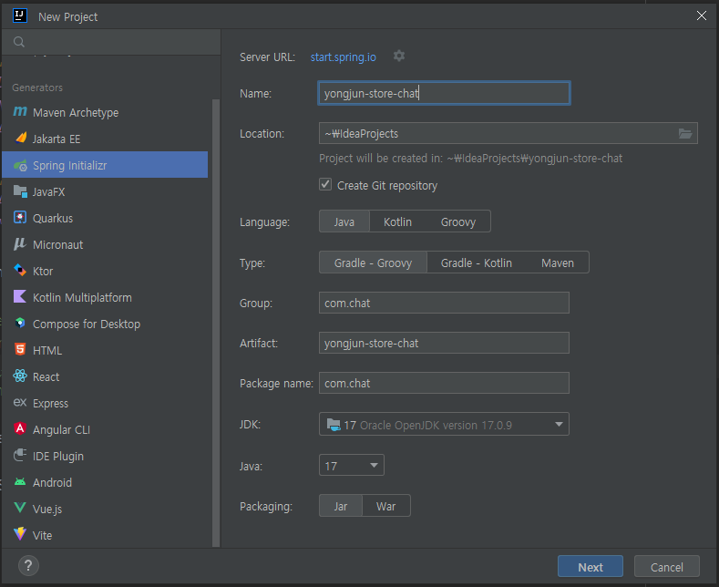
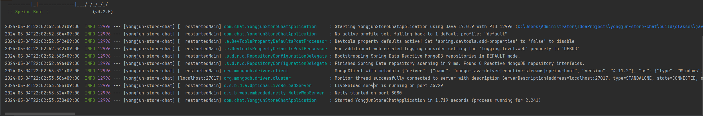

## MongoDB 설치

<a href="https://www.mongodb.com/try/download/community-kubernetes-operator" target="_blank">MongoDB 설치</a>  
<a href="https://www.mongodb.com/try/download/shell" target="_blank">MongoDB Shell 설치</a>
 - 설치 후, 저장 경로를 변경하지 않았다면 `C:\Program Files\MongoDB\Server\7.0\bin`
 - Windows 환경 변수 설정 - 시스템 변수 - path 편집 - `C:\Program Files\MongoDB\Server\7.0\bin` 추가
 - `cmd`에서 `mongosh` 명령시 접속 성공

<br>

---

<br>

## 프로젝트 생성



<br>


<br>

프로젝트 생성이 완료되면 `application.yml`에

```yml
spring:
  data:
    mongodb:
      host: localhost
      port: 27017
      database: chatdb
  application:
    name: yongjun-store-chat
```

 - `host`는 `local`환경에서 테스트 해볼 것이기 때문에 `localhost`
 - `port`는 `mongodb`에서 기본 포트롤 사용하는 `27017`
 - `database`는 채팅서버로 활용할 것 이기 때문에 `chatdb`이름으로 생성

<br>



 - `Netty`라는 서버로 실행된다.
 - `Netty`는 싱글 스레드 비동기 서버이다.


