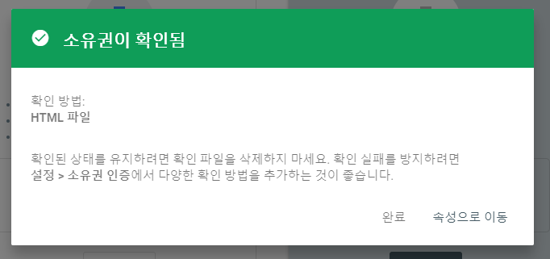
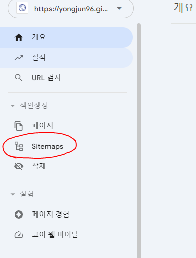

## Google search console
- 구글에 블로그가 검색되도록 해주는 서비스
- <a href="https://search.google.com/search-console/about" target="_blank">Google search console</a>

<br>

  

<br>

URL 접두어에 블로그 주소 입력


<br>

해당 `html`파일을 다운로드 하고, 깃허브 블로그 root 경로에 추가


<br>

`commit` 후, 1~2분 이후에 `확인`버튼을 클릭

<br>



<br>

소유권 확인 완료

<br>

---

### sitemap.xml 추가

```xml
---
layout:null
---

<?xml version="1.0" encoding="UTF-8"?>
<urlset xmlns="http://www.sitemaps.org/schemas/sitemap/0.9">

  
  <url>
    <loc>{{site.url}}{{ post.url | remove: 'index.html' }}</loc>
  </url>
  

  
  
  
  <url>
    <loc>{{site.url}}{{ page.url | remove: 'index.html' }}</loc>
  </url>
  
  
  

</urlset>
```

<br>

해당 코드`(google 크롤러가 url을 체크할 수 있게 해준다.)`를 `sitemap.xml`으로 만들어서 `root` 경로에 추가

<br>

---

### _config.yml url 추가

`root`경로에 `_config.yml`에 `url: "https://yongjun96.github.io"` 입력

<br>

---

### sitemap.xml 등록하기

- <a href="https://search.google.com/search-console/about" target="_blank">Google search console</a>에 다시 접속
- 권한이 생겼다면 관리 페이지로 접속된다.



`Sitemaps` 클릭

<br>


`sitemap.xml`을 입력하고 제출을 클릭 하면 완료


