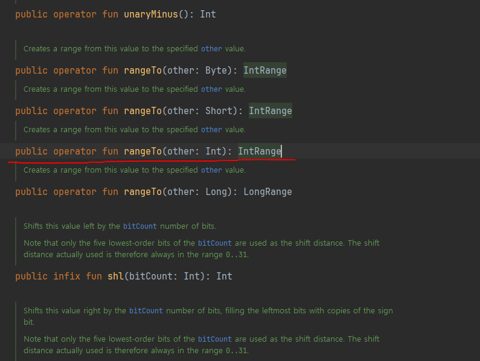
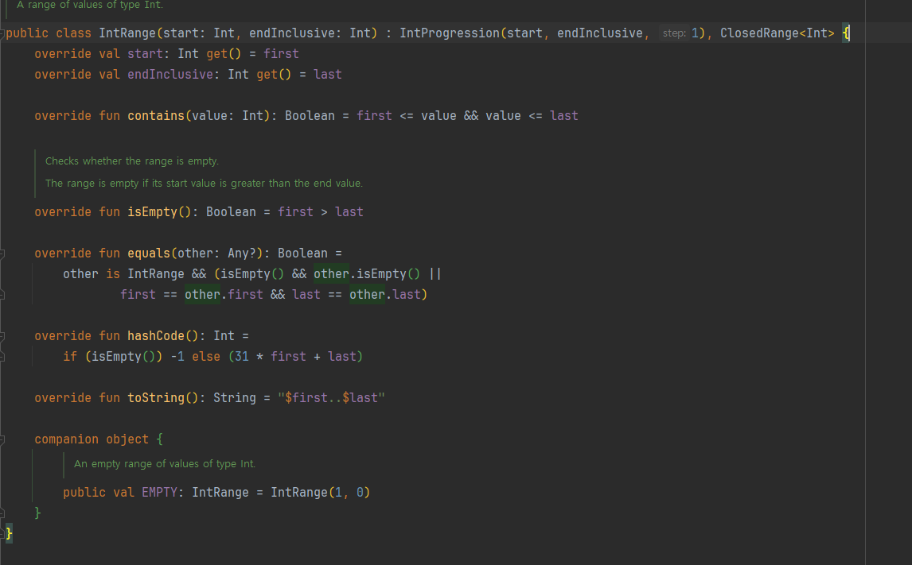
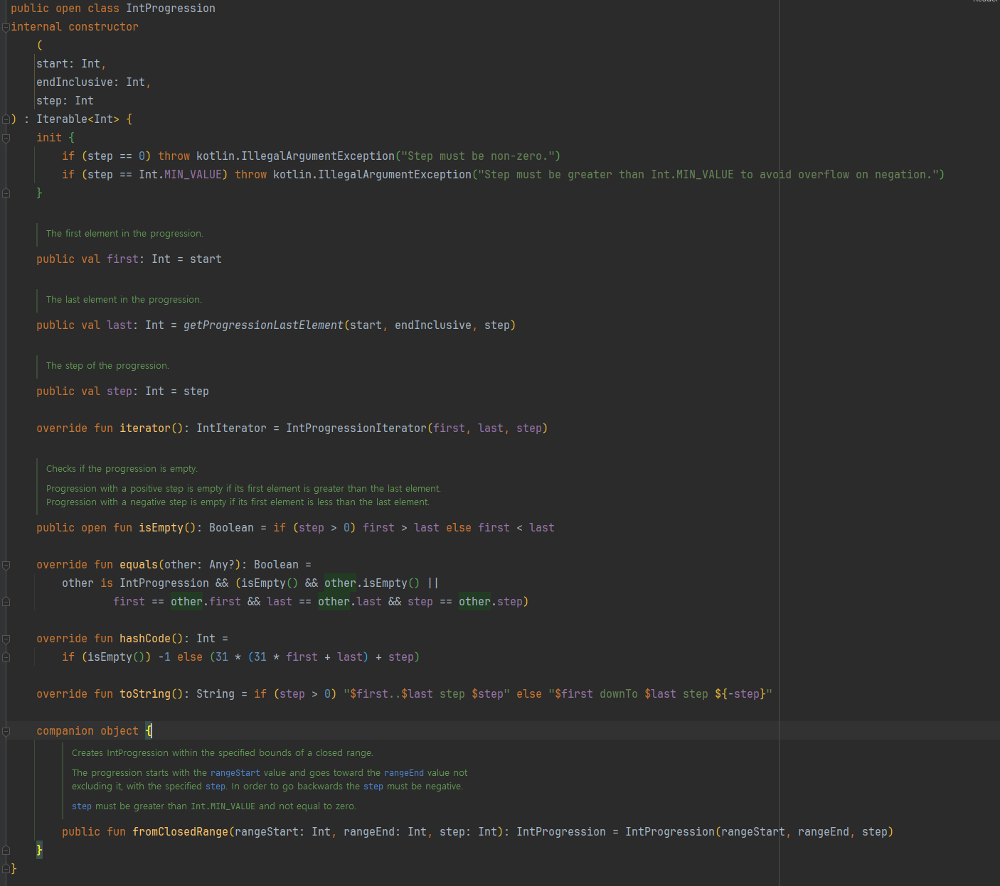

<br>

## 향상된 for문 (for-each문)

<br>

- 숫자가 있는 리스트나 배열같은 하나씩 출력하는 경우 주로 사용

<br>

for each문 예제
```kotlin
    val numbers = listOf(1L, 2L, 3L)

    for (number in numbers) {
        println(number)
    }
```
Java와 다른 점
 - 컬렉션을 만드는 방법 : `listOf(1L, 2L, 3L)` => 추후 추가 설명 예정
 - `:`대신 `in`을 사용  

Java와 공통점
 - `numbers`에 오는 타입은 `Iterable`이 구현된 타입이라면 모두 가능

<br>

---

<br>

## 전통적인 for문

<br>

for문 예제
```kotlin
    for(i in 1..3){
        println(i)
    }
```
`..`은 범위를 나타내는 연산자  
위에서 `1..3`은 `1 ~ 3`까지를 뜻 한다.

<br>

for문 내려가는 예제
```kotlin
    for(i in 3 downTo 1){
        println(i)
    }
```
`..`대신 `downTo`를 사용하여 `3 부터 1`까지 내려가는 반복을 수행

<br>

for문 정해진 만큼 올리는 경우 예제
```kotlin
    for(i in 1..5 step 2) {
        println(i)
    }
```
`in`과 `..`을 이용해서 `1 ~ 5`까지 반복 시키고 `step`으로 `2개씩` 증가 하도록 지정  

<br>

---

<br>

## Progression과 Range

<br>

- 동작 원리
  - `..`연산자는 범위를 만들어 내는 연산자
  - `IntRange`라는 실제 class에서 `IntProgression (등차수열)`을 상속 받는다

<br>

- rangeTo


<br>

- IntRange


<br>

- IntProgression
  - 시작 값
  - 끝 값
  - 공차
    - 위와 같은 3개의 변수가 필요하다.
    - 결국 등차 수열을 만들어 주는 것


<br>

- `3 downTo 1` : `시작 값 3` / `끝 값 1` / `공차 -1`인 등차 수열
- `1..5 step 2` : `시작 값 1` / `끝 값 5` / `공차 2`인 등차 수열

<br>

### downTo와 step은 함수!!

<br>

- 두개 모두 `중위 함수` 다음에 다룰 예정
  - `변수.함수이름(argument)` 대신
  - `변수 함수이름 argument`로 사용할 수 있도록 해주는 것

<br>

- step
```kotlin
public infix fun IntProgression.step(step: Int): IntProgression {
    checkStepIsPositive(step > 0, step)
    return IntProgression.fromClosedRange(first, last, if (this.step > 0) step else -step)
}
```

<br>

- downTo
```kotlin
public infix fun Int.downTo(to: Int): IntProgression {
    return IntProgression.fromClosedRange(this, to, -1)
}
```


<br>

---

<br>

## while문

<br>

- while문 예제
```kotlin
    var i = 1
    while (i <= 3){
        println(i)
        i++
    }
```
Java와 같은 방식으로 작성
- `do-while`또한 같다
