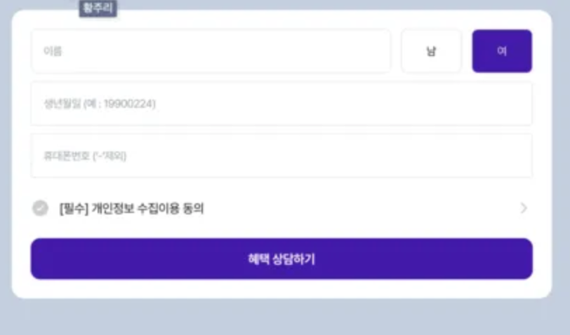

<br>

## 간단 설명

- 회고의 경우, 시간이 날 때 써가기로 했다. 
- 시간 순으로 작업한 것이 아니면 해당 작업은 다른 작업과 병행하여 진행하였다.
- 해당 작업은 간단한 `CRUD` 작업과 신규`private bucket`을 이용한 마케팅 동의 기능과 동영상 업로드가 목적이다.

---

## 첫 번째 작업

- 기본적으로 아래와 같이 개인정보 수집을 하여 저장하는 기능이 필요했다.



- 작업을 할 때 조금 힘들었던 점이 있었는데 그 이유는 `Kotlin`을 처음 사용하는 작업이었기 때문이다.
- 생각보다 어색하고 `Java`와 비슷하지만 다른 느낌으로 쓰기 불편했다.
- `null`을 제어하고 잘 활용한다면 `nullPointExeption`을 볼 일이 없다는 것은 매력적이긴 했다.

<br>

### Insert

- Service
```kotlin
    fun createCustomer(
  request: CreateCustomerRequest,
  ): Int? {
  marketingRepository.findEmail(request.phone)?.let { throw ApiException(ApiCode.EXISTS_CUSTOMER) }

        return marketingRepository.save(request)
    }
```

<br>

- Repository
```kotlin
fun save(request: CreateCustomerRequest): Int? {
        return writeDsl.insertInto(LANDING_MARKETING_CUSTOMER)
            .columns(
                LANDING_MARKETING_CUSTOMER.NAME,
                LANDING_MARKETING_CUSTOMER.PHONE,
                LANDING_MARKETING_CUSTOMER.GENDER,
                LANDING_MARKETING_CUSTOMER.BIRTHDAY,
                LANDING_MARKETING_CUSTOMER.ADDRESS,
                LANDING_MARKETING_CUSTOMER.CHANNEL,
                LANDING_MARKETING_CUSTOMER.AGREE
            )
            .values(
                request.name,
                request.phone,
                request.gender,
                request.birthday,
                request.address,
                request.channel,
                request.agree
            )
            .returning(LANDING_MARKETING_CUSTOMER.ID)
            .fetchOne()
            ?.getValue(LANDING_MARKETING_CUSTOMER.ID)
    }
```

- 정말 간단하게 작성된 코드지만, 지금 보면 굉장히 엉성한 부분이 존재한다.
- `save`가 실패하면 실패된 것이지 `?`를 사용해서 `null`인 경우도 허용하고 있다.
- 실패한 경우는 예외를 던지고 성공한 경우는 생성된 `ID`만을 반환해 주는게 적절해 보인다. 

<br>

#### 개선

- Service
```kotlin
    fun createCustomer(
        request: CreateCustomerRequest,
    ): Int {
        marketingRepository.findEmail(request.phone)?.let { throw ApiException(ApiCode.EXISTS_CUSTOMER) }

        return marketingRepository.save(request)?.id ?: throw ApiException(ApiCode.BAD_REQUEST)
    }
```

<br>

- Repository
```kotlin
    fun save(request: CreateCustomerRequest) = writeDsl
        .insertInto(LANDING_MARKETING_CUSTOMER)
            .columns(
                LANDING_MARKETING_CUSTOMER.NAME,
                LANDING_MARKETING_CUSTOMER.PHONE,
                LANDING_MARKETING_CUSTOMER.GENDER,
                LANDING_MARKETING_CUSTOMER.BIRTHDAY,
                LANDING_MARKETING_CUSTOMER.ADDRESS,
                LANDING_MARKETING_CUSTOMER.CHANNEL,
                LANDING_MARKETING_CUSTOMER.AGREE
            )
            .values(
                request.name,
                request.phone,
                request.gender,
                request.birthday,
                request.address,
                request.channel,
                request.agree
            )
            .returning(LANDING_MARKETING_CUSTOMER.ID)
            .fetchOne()
```

- 위와 같은 형식으로 저장이 완료되면 `ID`를 반환하고 실패하는 경우, 예외를 던지는 방식으로 작성하는게 더 안전하다고 생각된다.

<br>

#### Dao 개선

- 사실 위와 같이 정말 간단한 형태의 저장은 `Dao`를 사용해서 처리하는게 가독성을 높이는 대도 도움이 된다고 생각한다.

```kotlin
    fun createCustomer(
        request: CreateCustomerRequest,
    ): Int {
        marketingRepository.findEmail(request.phone)?.let { throw ApiException(ApiCode.EXISTS_CUSTOMER) }

        val customer = LandingMarketingCustomer(
            name = request.name,
            phone = request.phone,
            gender = request.gender,
            birthday = request.birthday,
            channel = request.channel,
            address = request.address,
            agree = request.agree,
        )

        landingMarketingCustomerDao.insert(customer)

        return customer.id ?: throw ApiException(ApiCode.BAD_REQUEST)
    }
```
- 위와 같이 `Dao`를 사용해서 `Repository`를 작성하지 않고 저장할 수 있다.

<br>

### Select

- Service
```kotlin
    fun getCustomerInfo(
        phone: String
    ): CustomerInfoResponse {
        return marketingRepository.findEmail(phone)
            ?: throw ApiException(ApiCode.CUSTOMER_PHONE_NOT_FOUND)
    }
```

<br>

- Repository
```kotlin
    fun findEmail(phone: String): CustomerInfoResponse? {
        return readDsl.selectFrom(LANDING_MARKETING_CUSTOMER)
            .where(LANDING_MARKETING_CUSTOMER.PHONE.eq(phone))
            .fetchOneInto(CustomerInfoResponse::class.java)
    }
```
- 간단한 코드이므로 단일 표현식을 사용해서 간결하게 표현하는 것이 더 좋을거 같다.

<br>

#### 단일 표현식 개선

- Service
```kotlin
    fun getCustomerInfo(phone: String): CustomerInfoResponse =
        marketingRepository.findEmail(phone)
            ?: throw ApiException(ApiCode.CUSTOMER_PHONE_NOT_FOUND)
```

<br>

- Repository
```kotlin
    fun findEmail(phone: String): CustomerInfoResponse? = readDsl
        .selectFrom(LANDING_MARKETING_CUSTOMER)
        .where(LANDING_MARKETING_CUSTOMER.PHONE.eq(phone))
        .fetchOneInto(CustomerInfoResponse::class.java)
```

<br>

---

<br>


