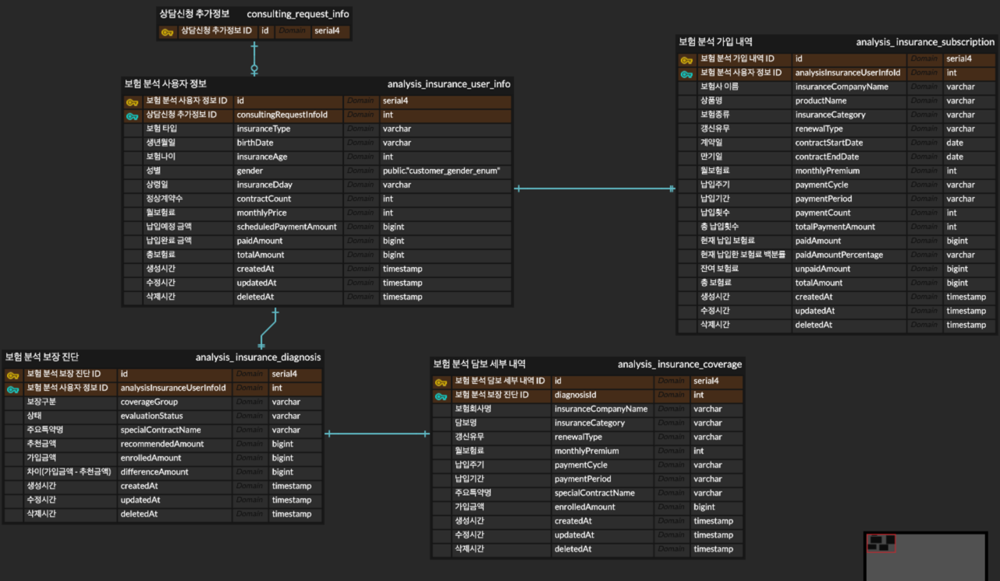

<br>

## 기획 설명

---

1. 작업 진행 과정
 - 회원이 상담 신청 -> 상담 배당 -> 상담에 필요한 보험 정보 할당 -> 데이터를 저장하고 관리 -> PDF 및 엑셀로 정보 다운로드

2. 해당 작업을 진행하는 이유는, 회원의 보험 데이터를 제공 받는 웹에서 확인은 가능하지만 `데이터를 보관하고
관리하는 것`이 힘들고 경우에 따라서 인쇄를 해야 하는 경우도 있고 엑셀로 정리리해야 하는 경우도 있기 때문에
진행하기로 하였다.

<br>

---

## 진행 과정

### 1. 스크랩핑
 - 가장 처음으로 준비해야 하는 것은 스크랩핑을 `어떻게 무엇으로 하느냐` 였다. <br>
처음으로 생각되었던 것은 `파이썬과 셀레니움을 이용하는 것` 이었다. <br>
하지만 우리 서비스의 대부분은 `코틀린을 사용`하고 있었고, 나중에 관리하는데 있어서 <br>
다들 알고 있는 코틀린으로 작성하는게 좋겠다고 생각되어 `코틀린과 셀레니움을 사용하기로 결정`하였다.

### 2. 데이터 조회 및 저장 방법
 - 스크랩핑 서버를 따로 관리하고 스크랩핑 `데이터는 json`으로 내려 받아서 운영 서버 `DB에 저장`하는 방식을 택했다. <br>
이유는, 회원 보험 정보를 제공해 주는 웹에 접근하기 위해서는 vpn접속이 필요 했는데 스크랩핑 서버는 우리 서버 `내부망을
이용`할 것이기 때문에 로컬에서 접근하고 테스트 하기 위해서는 우리 쪽 개발 vpn과 웹 쪽 vpn을 같이 연결한 상태에서 진행
해야 하기 때문이다.<br>
관리가 까다로워 질 것 같기도 했고, DB의 `데이터를 조작하는 것은 한 곳에서 하는 것이 데이터 무결성`을 지키는데 
좋다고 생각했다.

### 3. 테이블 설계
 - 생각보다 `Table Depth가 깊어 지는 구조` 였고, 데이터를 간결하게 처리하기 보단 `정확하고 누락되지 않도록` 해야 했기
때문에 처음 보더라도 알 수 있고, 데이터를 누락하거나 요약해서 저장하지 않는 것에 초점을 두고 설계했다.
 <br><br>

 - 러프하게 작성한 ERD


### 4. 서버 세팅
 - 기본적으로 스크랩핑 서버는 내부망을 이용해야 하기 때문에 NAT GW에 연결된 private subnet에 만들어 주었다.
<br> 외부에서 접속은 같은 VPC내에 IGW에 연결된 public subnet에 존재하는 VPN용 인스턴스를 사용한다.<br>
그 후, 스크랩핑 서버 내에서 보험 웹에 접근(특정 도메인)하는 경우 VPN을 라우팅 해주었다. <br><br>
 - 개발서버 기준 스펙 세팅
   - Amazon Machine Image(AMI) : al2023-ami-2023.7.20250428.1-kernel-6.1-arm64
   - 인스턴스 유형 : t4g.small
   - 스토리지(GIB) : 16GB (무료로 사용 가능한 수준으로 할당)
<br>
 - 개발 서버에서는 테스트 위주로 작업을 수행할 것이기 때문에 최소한의 스펙으로 세팅하였다. <br>
<br>

#### VPN 라우팅 쉘 스크립트
```shell
# domain_nopull.sh

# VPN 설정 파일
VPN_CONFIG="file_name.ovpn"

# 라우팅할 도메인 목록 : VPN을 통해 우회할 도메인 목록
DOMAINS=("우회할 도메인.com")

# 임시 설정 파일 : 수정된 VPN 설정 파일의 임시 저장 경로
TMP_CONFIG="/tmp/example_vpn_config.ovpn"

# 원본 VPN 설정 파일 복사
# route-nopull 추가
# VPN 서버에서 푸시되는 기본 라우팅 정보(0.0.0.0/0)를 무시
# 기본적으로 모든 트래픽은 VPN을 안 타게 됨
cp "$VPN_CONFIG" "$TMP_CONFIG"
echo "route-nopull" >> "$TMP_CONFIG"

# 각 도메인에 대한 IP 주소 조회 및 라우팅 설정 추가
for domain in "${DOMAINS[@]}"; do
    echo "도메인 처리 중: $domain"

    # dig 명령으로 도메인의 IP 주소 목록을 조회
    ips=$(dig +short "$domain" | grep -v "\.$")

    # 해당 IP에 대해 단일 호스트 라우팅(255.255.255.255)을 설정
    # 즉, 이 IP만 VPN 인터페이스를 통해 라우팅되도록 설정
    for ip in $ips; do
        echo "IP 발견: $ip, 라우팅 추가 중..."
        echo "route $ip 255.255.255.255" >> "$TMP_CONFIG"
    done
done

# 수정된 설정 파일로 OpenVPN 클라이언트를 백그라운드 실행(daemon)
echo "수정된 설정으로 OpenVPN 연결 중..."
openvpn --config "$TMP_CONFIG" --daemon
```
<br>

#### 해당 쉘 스크립트를 실행하기 위해서 권한 부여와 연결 명령
```shell
# 권한부여 및 연결 / 연결확인

# 쓰기
sudo chmod +x /etc/openvpn/client
# 읽기
sudo chmod +rx /etc/openvpn/client

# 이동
cd /etc/openvpn/client
# 연결
sudo ./domain_nopull.sh

# 연결여부 확인
ps aux | grep openvpn

# 연결 성공 시 ex). 
[ec2-user@ip-10-10-102-132 client]$ ps aux | grep openvpn
root        9999  0.0  0.3  13824  6656 ?        Ss   16:57   0:00 openvpn --config /tmp/example_vpn_config.ovpn --daemon
ec2-user    9999  0.0  0.0 222096  1784 pts/0    S+   16:57   0:00 grep --color=auto openvpn
```

---

### Trouble Shooting

<br>

#### 스크랩핑 프로젝트 세팅
- 언어를 코틀린으로 선택한 만큼, 프레임워크는 Spring Boot로 선택해서 프로젝트를 생성했다. <br>
  API 통신이 필요 하므로 `spring-boot-starter-web`의존성을 부여한 상태로 생성했다. <br>
  [ JavaVersion : 21 / springframework.boot version : 3.4.5 / selenium 관련 의존성 추가 ] <br>
  <br>
- 여기서 사실 여러가지 시행착오를 겪었다.. <br>
  처음에는 `ChromeDriver` + `Chrome`로 작업을 진행했고, 로컬에서 스크랩핑하는 것 까지는 <br>
무난하게 완료했다. 예전에 Java를 활용해서 고난한 스크랩핑을 해 왔어서 나름 수월했다. <br>
하지만, 언제나 그러하 듯 문제가 발생했다. 인스턴스의 `AMI`를 `arm64`로 잡았고 도커로 빌드하기 때문이었다. <br>
`도커 arm64` + `Chrome`는 공식 이미지가 `x86 전용`이라 `arm에서 에러가 발생`했다.. <br>

```dockerfile
# ARM용 CHROME 설치
ENV CHROME_VERSION=138.0.7204.49
ENV CHROME_URL=https://storage.googleapis.com/chrome-for-testing-public/$CHROME_VERSION/linux64/chrome-linux64.zip
RUN wget -q $CHROME_URL -O /tmp/chrome.zip && \
    unzip /tmp/chrome.zip -d /tmp && \
    mv /tmp/chrome-linux64 /opt/chrome && \
    ln -s /opt/chrome/chrome /usr/bin/google-chrome && \
    rm -rf /tmp/chrome.zip

# ARM용 ChromeDriver 설치
ENV CHROMEDRIVER_URL=https://storage.googleapis.com/chrome-for-testing-public/$CHROME_VERSION/linux64/chromedriver-linux64.zip
RUN wget -q $CHROMEDRIVER_URL -O /tmp/chromedriver.zip && \
    unzip /tmp/chromedriver.zip -d /tmp && \
    mv /tmp/chromedriver-linux64/chromedriver /usr/bin/chromedriver && \
    chmod +x /usr/bin/chromedriver && \
    rm -rf /tmp/chromedriver.zip /tmp/chromedriver-linux64
```
 - 위와 같이 설치하면 잘 작동할 것 같았지만, 기본 적인 필수 패키지가 너무 많았다. <br>
해당 패키지를 설치 전에 설치해 줘야 한다.
```dockerfile
# 기본 패키지 설치
RUN apt-get update && apt-get install -y \
    wget unzip curl gnupg ca-certificates \
    libnss3 libxss1 libappindicator1 libindicator7 \
    libasound2 libatk-bridge2.0-0 libatk1.0-0 libcups2 \
    libdbus-1-3 libgdk-pixbuf2.0-0 libnspr4 libx11-xcb1 \
    fonts-liberation libxcomposite1 libxdamage1 libxrandr2 \
    libgbm1 xdg-utils libu2f-udev libvulkan1 libxshmfence1 \
    && rm -rf /var/lib/apt/lists/*
```
 - 이렇게 추가하면 되나? -> 안된다. 이유는 `ChromeDriver`와 `Chrome`버전이 실제로 정확히 같지 않아서 인데
어이 없게도 `Chrome`는 `arm64/linux`를 지원하지 않는다.. <br>
위에서 받고 있는 `linux64` 엄연히 다르다 ㅠ <br>


 - 이 것 때문에 삽질을 상당히 많이 했다. <br>
`chromedriver` + `chrome` + `chrome-headless-shell`이 전부 호환되도록 맞추는게 불가능했다. <br>
어떻게든 `chrome`으로 무조건 해야 하는건 아니었기 때문에 찾아 본 결과 `Chromium`로 가능 하다는 것이 었다. <br>

```dockerfile
RUN apt-get update && apt-get install -y \
    wget unzip curl gnupg ca-certificates \
    chromium-browser chromium-chromedriver \
    libnss3 libxss1 libatk1.0-0 libatk-bridge2.0-0 libgtk-3-0 \
    libdrm2 libgbm1 libasound2 libx11-xcb1 \
    fonts-liberation xdg-utils \
    && apt-get clean
```
 - 필수 패키지와 함께 `Chromium`를 설치해서 사용 가능했다!


