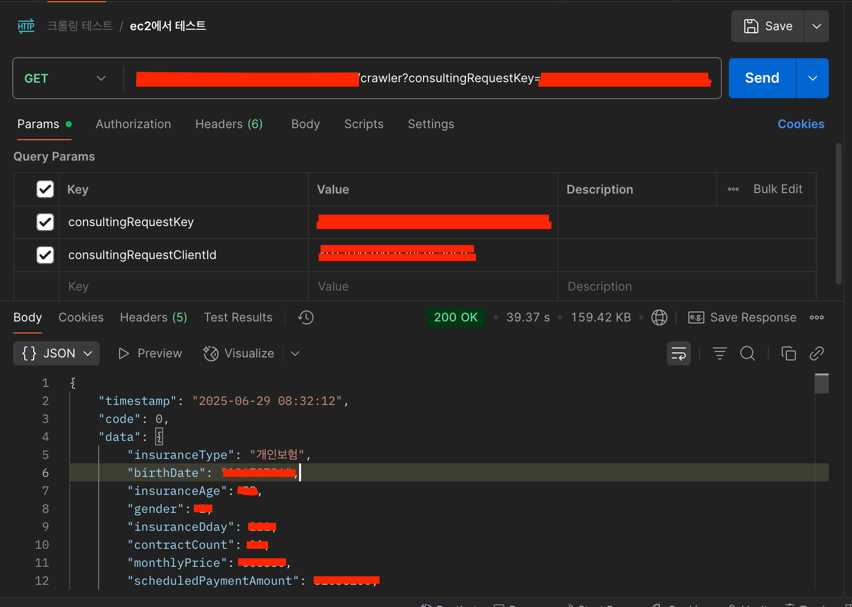
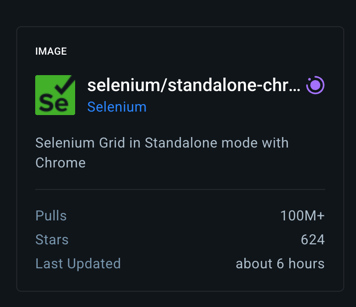

<br>

## 기획 설명

---

1. 작업 진행 과정
 - 회원이 상담 신청 -> 상담 배당 -> 상담에 필요한 보험 정보 할당 -> 데이터를 저장하고 관리 -> PDF 및 엑셀로 정보 다운로드

2. 해당 작업을 진행하는 이유는, 회원의 보험 데이터를 제공 받는 웹에서 확인은 가능하지만 `데이터를 보관하고
관리하는 것`이 힘들고 경우에 따라서 인쇄를 해야 하는 경우도 있고 엑셀로 정리리해야 하는 경우도 있기 때문에
진행하기로 하였다.

<br>

---

## 진행 과정

### 1. 스크랩핑
 - 가장 처음으로 준비해야 하는 것은 스크랩핑을 `어떻게 무엇으로 하느냐` 였다. <br>
처음으로 생각되었던 것은 `파이썬과 셀레니움을 이용하는 것` 이었다. <br>
하지만 우리 서비스의 대부분은 `코틀린을 사용`하고 있었고, 나중에 관리하는데 있어서 <br>
다들 알고 있는 코틀린으로 작성하는게 좋겠다고 생각되어 `코틀린과 셀레니움을 사용하기로 결정`하였다.

### 2. 데이터 조회 및 저장 방법
 - 스크랩핑 서버를 따로 관리하고 스크랩핑 `데이터는 json`으로 내려 받아서 운영 서버 `DB에 저장`하는 방식을 택했다. <br>
이유는, 회원 보험 정보를 제공해 주는 웹에 접근하기 위해서는 vpn접속이 필요 했는데 스크랩핑 서버는 우리 서버 `내부망을
이용`할 것이기 때문에 로컬에서 접근하고 테스트 하기 위해서는 우리 쪽 개발 vpn과 웹 쪽 vpn을 같이 연결한 상태에서 진행
해야 하기 때문이다.<br>
관리가 까다로워 질 것 같기도 했고, DB의 `데이터를 조작하는 것은 한 곳에서 하는 것이 데이터 무결성`을 지키는데 
좋다고 생각했다.

### 3. 테이블 설계
 - 생각보다 `Table Depth가 깊어 지는 구조` 였고, 데이터를 간결하게 처리하기 보단 `정확하고 누락되지 않도록` 해야 했기
때문에 처음 보더라도 알 수 있고, 데이터를 누락하거나 요약해서 저장하지 않는 것에 초점을 두고 설계했다.
 <br><br>

 - 러프하게 작성한 ERD


### 4. 서버 세팅
 - 기본적으로 스크랩핑 서버는 내부망을 이용해야 하기 때문에 NAT GW에 연결된 private subnet에 만들어 주었다.
<br> 외부에서 접속은 같은 VPC내에 IGW에 연결된 public subnet에 존재하는 VPN용 인스턴스를 사용한다.<br>
그 후, 스크랩핑 서버 내에서 보험 웹에 접근(특정 도메인)하는 경우 VPN을 라우팅 해주었다. <br><br>
 - 개발서버 기준 스펙 세팅
   - Amazon Machine Image(AMI) : al2023-ami-2023.7.20250428.1-kernel-6.1-arm64
   - 인스턴스 유형 : t4g.small
   - 스토리지(GIB) : 16GB (무료로 사용 가능한 수준으로 할당)
<br>
 - 개발 서버에서는 테스트 위주로 작업을 수행할 것이기 때문에 최소한의 스펙으로 세팅하였다. <br>
<br>

#### VPN 라우팅 쉘 스크립트
```shell
# domain_nopull.sh

# VPN 설정 파일
VPN_CONFIG="file_name.ovpn"

# 라우팅할 도메인 목록 : VPN을 통해 우회할 도메인 목록
DOMAINS=("우회할 도메인.com")

# 임시 설정 파일 : 수정된 VPN 설정 파일의 임시 저장 경로
TMP_CONFIG="/tmp/example_vpn_config.ovpn"

# 원본 VPN 설정 파일 복사
# route-nopull 추가
# VPN 서버에서 푸시되는 기본 라우팅 정보(0.0.0.0/0)를 무시
# 기본적으로 모든 트래픽은 VPN을 안 타게 됨
cp "$VPN_CONFIG" "$TMP_CONFIG"
echo "route-nopull" >> "$TMP_CONFIG"

# 각 도메인에 대한 IP 주소 조회 및 라우팅 설정 추가
for domain in "${DOMAINS[@]}"; do
    echo "도메인 처리 중: $domain"

    # dig 명령으로 도메인의 IP 주소 목록을 조회
    ips=$(dig +short "$domain" | grep -v "\.$")

    # 해당 IP에 대해 단일 호스트 라우팅(255.255.255.255)을 설정
    # 즉, 이 IP만 VPN 인터페이스를 통해 라우팅되도록 설정
    for ip in $ips; do
        echo "IP 발견: $ip, 라우팅 추가 중..."
        echo "route $ip 255.255.255.255" >> "$TMP_CONFIG"
    done
done

# 수정된 설정 파일로 OpenVPN 클라이언트를 백그라운드 실행(daemon)
echo "수정된 설정으로 OpenVPN 연결 중..."
openvpn --config "$TMP_CONFIG" --daemon
```
<br>

#### 해당 쉘 스크립트를 실행하기 위해서 권한 부여와 연결 명령
```shell
# 권한부여 및 연결 / 연결확인

# 쓰기
sudo chmod +x /etc/openvpn/client
# 읽기
sudo chmod +rx /etc/openvpn/client

# 이동
cd /etc/openvpn/client
# 연결
sudo ./domain_nopull.sh

# 연결여부 확인
ps aux | grep openvpn

# 연결 성공 시 ex). 
[ec2-user@ip-10-10-102-132 client]$ ps aux | grep openvpn
root        9999  0.0  0.3  13824  6656 ?        Ss   16:57   0:00 openvpn --config /tmp/example_vpn_config.ovpn --daemon
ec2-user    9999  0.0  0.0 222096  1784 pts/0    S+   16:57   0:00 grep --color=auto openvpn
```

---

### Trouble Shooting

#### 스크랩핑 프로젝트 세팅
- 언어를 코틀린으로 선택한 만큼, 프레임워크는 Spring Boot로 선택해서 프로젝트를 생성했다. <br>
  API 통신이 필요 하므로 `spring-boot-starter-web`의존성을 부여한 상태로 생성했다. <br>
  [ JavaVersion : 21 / springframework.boot version : 3.4.5 / selenium 관련 의존성 추가 ] <br>

#### Docker 세팅

- 여기서 사실 여러가지 시행착오를 겪었다.. <br>
  처음에는 `ChromeDriver` + `Chrome`로 작업을 진행했고, 로컬에서 스크랩핑하는 것 까지는 <br>
무난하게 완료했다. 예전에 `Java`를 활용해서 고난한 스크랩핑을 해 왔어서 나름 수월했다. <br>
하지만, 언제나 그러하 듯 문제가 발생했다. 인스턴스의 `AMI`를 `arm64`로 잡았고 도커로 빌드하기 때문이었다. <br>
`도커 arm64` + `Chrome`은 공식 이미지가 `x86 전용`이라 `arm에서 에러가 발생`했다.. <br>

```dockerfile
# ARM용 CHROME 설치
ENV CHROME_VERSION=138.0.7204.49
ENV CHROME_URL=https://storage.googleapis.com/chrome-for-testing-public/$CHROME_VERSION/linux64/chrome-linux64.zip
RUN wget -q $CHROME_URL -O /tmp/chrome.zip && \
    unzip /tmp/chrome.zip -d /tmp && \
    mv /tmp/chrome-linux64 /opt/chrome && \
    ln -s /opt/chrome/chrome /usr/bin/google-chrome && \
    rm -rf /tmp/chrome.zip

# ARM용 ChromeDriver 설치
ENV CHROMEDRIVER_URL=https://storage.googleapis.com/chrome-for-testing-public/$CHROME_VERSION/linux64/chromedriver-linux64.zip
RUN wget -q $CHROMEDRIVER_URL -O /tmp/chromedriver.zip && \
    unzip /tmp/chromedriver.zip -d /tmp && \
    mv /tmp/chromedriver-linux64/chromedriver /usr/bin/chromedriver && \
    chmod +x /usr/bin/chromedriver && \
    rm -rf /tmp/chromedriver.zip /tmp/chromedriver-linux64
```
 - 위와 같이 설치하면 잘 작동할 것 같았지만, 기본 적인 필수 패키지가 너무 많았다. <br>
해당 패키지를 설치 전에 설치해 줘야 한다.
```dockerfile
# 기본 패키지 설치
RUN apt-get update && apt-get install -y \
    wget unzip curl gnupg ca-certificates \
    libnss3 libxss1 libappindicator1 libindicator7 \
    libasound2 libatk-bridge2.0-0 libatk1.0-0 libcups2 \
    libdbus-1-3 libgdk-pixbuf2.0-0 libnspr4 libx11-xcb1 \
    fonts-liberation libxcomposite1 libxdamage1 libxrandr2 \
    libgbm1 xdg-utils libu2f-udev libvulkan1 libxshmfence1 \
    && rm -rf /var/lib/apt/lists/*
```
 - 이렇게 추가하면 되나? -> 안된다. 이유는 `ChromeDriver`와 `Chrome`버전이 실제로 정확히 같지 않아서 인데
어이 없게도 `Chrome`는 `arm64/linux`를 지원하지 않는다.. <br>
위에서 받고 있는 `linux64`와는 엄연히 다르다 ㅠ <br>


 - 이 것 때문에 삽질을 상당히 많이 했다. <br>
`chromedriver` + `chrome` + `chrome-headless-shell`이 전부 호환되도록 맞추는게 불가능했다. <br>
어떻게든 `chrome`으로 무조건 해야 하는건 아니었기 때문에 찾아 본 결과 `Chromium`을 발견 했다. <br>

```dockerfile
FROM eclipse-temurin:21-jdk-jammy

# 필수 패키지 설치
RUN apt-get update && apt-get install -y \
    chromium \
    chromium-driver \
    fonts-nanum fonts-noto-cjk \
    curl unzip \
    --no-install-recommends && \
    apt-get clean && rm -rf /var/lib/apt/lists/*

# 환경변수 설정 (chromedriver 자동 인식)
ENV CHROME_BIN=/usr/bin/chromium
ENV webdriver.chrome.driver=/usr/lib/chromium/chromedriver
ENV PATH="${PATH}:/usr/lib/chromium"
ENV GRADLE_OPTS="-Xmx1024m -Xms512m -Dorg.gradle.daemon=false"

WORKDIR /app
COPY . .
RUN chmod +x ./gradlew
RUN ./gradlew clean bootJar --no-daemon
RUN cp build/libs/*.jar app.jar

EXPOSE 15914
ENTRYPOINT ["java", "-jar", "app.jar"]

```
 - 필수 패키지와 함께 `Chromium` + `ChromiumDriver`를 설치해서 사용 가능했다!
 - 하지만, 생각과는 다르게 안정성이 떨어졌다. 실행 되었던 `Chromium`가 죽지 않고 살아 있어
메모리가 부족해 진다 거나 동시에 여러 개의 스크랩핑을 하게 되면 서버가 죽을 수도 있고, 
현재는 문제가 없지만 버전 관련 문제가 생길 수도 있는 위험성도 존재 했다. <br>
그렇다고 `Chromium`의 버전을 고정하면, `APT`가 최신 버전으로 올라갔을 때 충돌이 발생할 수도 있다.
<br><br>

#### 메모리 부족 문제 

 - 일단 여기서 지금 당장 문제가 되는 메모리 문제부터 해결 하기로 했다. <br>
가장 확실하고 직관적인 방법은 인스턴스의 스펙을 올리는 것이다. `t4g.small`은 굉장히 낮은 스펙이고
`t4g.medium`으로 올린 후 스크랩핑 코드를 `finally`로 항상 종료해 준다면 문제가 해결된다.
```kotlin
finally { 
  driver.quit()
}
```
 - 하지만
   - `t4g.small` 요금 : 0.0208 USD 시간당
   - `t4g.medium` 요금 : 0.0416 USD 시간당 
<br>
보이는 것과 같이 시간당 요금이 두배가 나가게 된다. <br>
메모리도 두배가 오르지만 개발을 하는데 있어서 성능과 비용은 항상
생각해 보고 맞춰야 한다고 생각한다. (내 돈이 아니기도 하다 ㅎㅎ)
<br><br>
 - 개발 서버이기 때문에 `t4g.small`를 그대로 사용 하기로 하고 `가상 메모리 스왑(SWAP)`을 사용하려고 한다. <br>
   - `물리 RAM`이 부족할 때를 대비해, `디스크 공간 일부를 "가상 메모리(SWAP)"로 사용`하도록 설정 
```shell
# 설정 방법 (Amazon Linux 2, Ubuntu 공통)

# 1. 2GB 스왑 파일 생성 (크기는 상황에 따라 조절)
#  - /swapfile이라는 파일을 디스크에 2GB 크기로 생성
#  - 디스크 공간을 예약만 함 (실제 쓰이지 않음)
#  - 빠르고 효율적인 fallocate 사용 
sudo fallocate -l 2G /swapfile

# 2. 스왑 파일 권한 설정
#  - 루트만 읽고 쓸 수 있도록 권한 설정 (보안 목적)
#  - 스왑 파일은 시스템 메모리 역할을 하기 때문에 권한 제한 필수
sudo chmod 600 /swapfile

# 3. 스왑 영역으로 설정
#  - /swapfile을 실제 swap 영역으로 초기화
sudo mkswap /swapfile

# 4. 스왑 사용 시작
sudo swapon /swapfile

# 5. 정상 작동 확인
#  - swapon -s : 현재 사용 중인 스왑 리스트 출력
#  - free -m : 전체 메모리 + 스왑 상태를 MB 단위로 확인
swapon -s
free -m

# 서버 재시작 후에도 유지되게 하려면 /etc/fstab 수정
# - /etc/fstab은 부팅 시 마운트 할 파일 시스템 정의 파일
# - 이 줄을 추가하면 서버 재시작 시에도 자동으로 스왑 사용됨
echo '/swapfile none swap sw 0 0' | sudo tee -a /etc/fstab
```
 - `SWAP`을 통해 메모리가 부족할 때 `(Out of Memory(OOM))`을 방지하고 조금의 안정성을 확보했다. <br>
하지만 너무 큰 `SWAP`은 성능 저하를 유발할 가능성이 있어 기존 메모리 `1 ~ 2배`정도가 적당하다. <br>
   - 디스크 공간 일부를 사용하는 것이기 때문에 실제 램보다 성능이 현저히 떨어져 너무 많은 사용은 성능에 문제가 생긴다.
   - 기존 램처럼 처리 하길 기대한 다기 보단, 기존 램이 작업을 처리할 때 까지 작업들을 대기 시켜 놓는 다는 개념으로 생각하면 될 듯 하다.
<br><br>

#### Chromium를 직접 설치해서 사용하는게 맞는가?

 - `Chromium`를 직접 설치해서 사용 하기는 너무 무겁기도 했고 버전도 그렇고 걸리는게 너무 많았다.
   - 지금 당장은 문제가 없었지만, 곧 생길 것 같은 느낌이었다.. <br><br>
 - 그래서 생각을 전환해 보기로 했다. 
   - `Chromium`를 꼭 사용해야 하는가? ➡ ❌
   - `chrome`을 꼭 사용해야 하는가? ➡ ❌
   - 꼭 직접 설치해서 사용해야 하는가? ➡ ❌
<br><br>

 - 그래서 스크랩핑에 적합한 다른 `browser`를 먼저 찾아 보기로 했다.
   - Firefox ➡ ⭕️
   - Microsoft Edge ➡ ⭕️
   - Safari ➡ ⭕️
   - Opera ➡ ⭕️
   - Whale ➡ ⭕️
<br><br>
 - 대부분의 `browser`들이 문제 없이 웹을 잘 가져 왔고 그 중, 첫 번째로 `Firefox`를 이용해 보기로 했다.
 - 위에서 다시 생각했던 `꼭 직접 설치해서 사용해야 하는가?`는 `누군가 이미 만든 이미지를 사용할 수는 없나?` 라는 
생각이 문득 들었다. <br>
당연히 직접 이미지를 만들어서 사용 한다면 좋겠지만, 시간이나 앞으로 유지보수를 생각하면 누군가 계속 관리하고
여러 사람이 사용 중인 이미지를 사용하는게 더 효율적이라고 생각했다.


 - `DockerHub`로 가 봤는데.. 많은 사람들이 이미 사용하고 있고, 관리도 잘되고 있는 이미지가 존재했다.. 🥹
 - 일단 `SpringApp`을 같이 올려야 하기 때문에 `docker-compose`로 작성 하기로 했다.
```dockerfile
version: "3"
services:
  selenium:
    image: selenium/standalone-firefox:latest
    ports:
      - "4444:4444"
    shm_size: 2g

  app:
    build:
      context: .
      dockerfile: Dockerfile
    ports:
      - "사용할 포트:사용할 포트"
    environment:
      - SELENIUM_REMOTE_URL=http://selenium:4444/wd/hub
    depends_on:
      - selenium
```
 - `standalone-firefox`는 가장 최신 버전을 사용하고 `SpringApp`으로 사용할 현재 프로젝트의 `Dockerfile`
을 지정했다.
   - `app컨테이너`에서 `http://selenium:4444/wd/hub` 로 직접 연결해서 `services`에 올려진 `selenium`을
      직접 사용하도록 했다.

```dockerfile
# -------- 1단계: Gradle 빌드 --------
FROM eclipse-temurin:21-jdk-jammy AS builder

WORKDIR /app
COPY . .

RUN chmod +x ./gradlew && \
    ./gradlew clean bootJar --no-daemon --no-build-cache

# -------- 2단계: 실행 이미지 --------
FROM eclipse-temurin:21-jdk-jammy

WORKDIR /app

# 실행에 필요한 JAR만 복사
COPY --from=builder /app/build/libs/*.jar app.jar

# 포트 노출
EXPOSE 사용할 포트

# 실행
ENTRYPOINT ["java", "-jar", "app.jar"]
```
 - 위와 같은 `Dockerfile` 또한 `SpringApp`을 실행할 수 있도록 수정해 주었다.
```shell
# 도커 컴포즈 백그라운드 실행 
docker-compose up --build -d
# 도커 컴포즈 로그 보기
docker-compose logs -f app
```
 - `GitHub`의 프로젝트를 `clone`하고 `docker-compose`를 실행해 주면 테스트 준비 완료


 - 문제 없이 잘 작동하고 메모리도 안정적이었다. <br><br>

 - 근데 여기서 하나 더 생각난 것이 `Chrome도 있을 것 같은데??`였다. <br>



 - 당연 하게도 관리되고 있는 이미지가 있었으며, `Safari`, `Edge` 등.. 대부분의 `browser`가 관리되고 있는 이미지로
존재했다. <br>
다른 이미지들도 테스트 해보면 좋겠지만, 시간 관계상 `firefox`를 사용하는 것으로 하고 나머지는 나중에 확인해 보도록 하고
넘어 갔다. <br><br>

#### 로컬에서 코드를 직접 돌려 보려면...?
 - 로컬에서 코드를 직접 돌리려면 `driverOptions`도 설정해 줘야 하 `os`도 다르기 때문에 각기 다른 세팅이 필요했다. <br>
현재 사용 중인 `os`가 `macOS` 인지 아니면 `ARM64`를 사용하는지 확인이 필요하고 로컬은 `GUI`를 사용하기 때문에
`headless`나 `no-sandbox`같은 옵션은 필요하지 않다. <br>
`WebDriver`생성 방식 또한 로컬 환경에 직접 설치된 `browser`를 사용할 것인지 도커 내에 실행 중인 `컨테이너`를 사용
할 것 인지도 분기해 주어야 했다.

```kotlin
class FirefoxDriverWrapper {

    fun createDriver(): WebDriver {
        val isArmLinux = System.getProperty("os.arch") == "aarch64" &&
                !System.getProperty("os.name").contains("Mac", ignoreCase = true)

        val options = if (isArmLinux) {
            FirefoxOptions().apply {
                addArguments("--headless")
                addArguments("--no-sandbox")
                addArguments("--disable-dev-shm-usage")
                addArguments("--width=1920")
                addArguments("--height=1080")
            }
        }else{
            FirefoxOptions().apply {
                addArguments("--width=1920")
                addArguments("--height=1080")
                setLogLevel(FirefoxDriverLogLevel.ERROR)
            }
        }

        return if (isArmLinux) {
            // 도커 내부 selenium 컨테이너로 연결
            val seleniumUrl = System.getenv("SELENIUM_REMOTE_URL") ?: "http://localhost:4444/wd/hub"
            RemoteWebDriver(URL(seleniumUrl), options)
        }else{
            // 로컬에서는 사용 중인 파이어폭스 사용
            FirefoxDriver(options)
        }
    }
}
```
 - 해당 `Wrapper`를 통해 `macOS`인지 `ARM64`인지 분기 하도록 하고 환경에 맞춰 세팅해 주었다. <br>
이렇게 하면 서비스에서 `driver`를 사용할 때 `firefoxDriverWrapper`를 호출해서 사용하면
어떠한 환경에서도 맞춰서 작동하게 된다.
```kotlin
val driver = firefoxDriverWrapper.createDriver()
```
